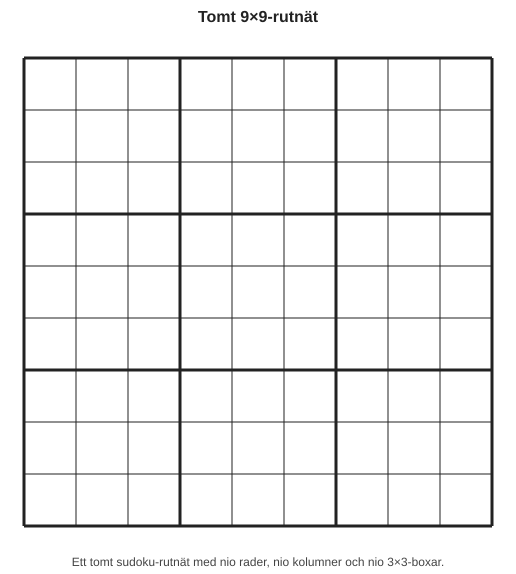
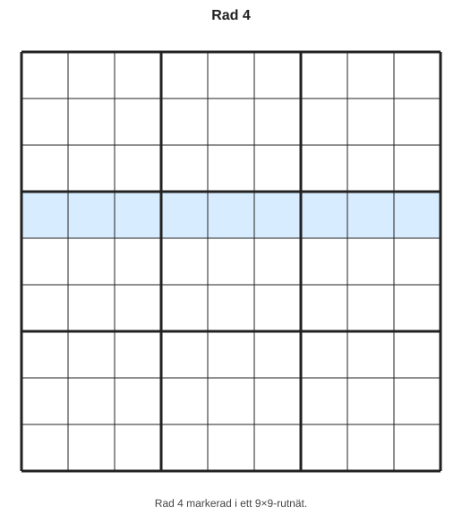
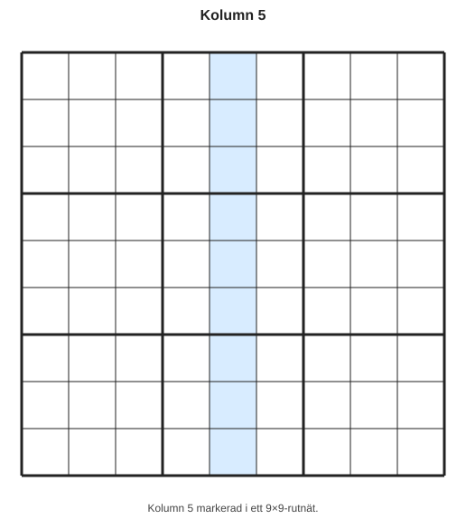
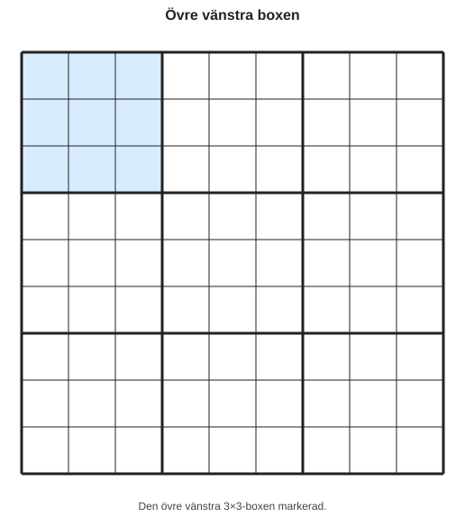

# Kapitel 1: Sudokuns regler och uppbyggnad

## Varför detta kapitel finns

Innan du kan lösa sudoku behöver du känna dig trygg med själva rutnätet. Många nybörjare fastnar inte för att reglerna är svåra, utan för att de inte vet var de ska titta.

I det här kapitlet lär du dig de tre viktigaste delarna i ett sudoku: rad, kolumn och box.

## Lärandemål

Efter kapitlet ska du kunna:

- förklara vad en rad är,
- förklara vad en kolumn är,
- förklara vad en box är,
- förstå grundregeln för klassisk 9×9-sudoku,
- peka ut vilka rutor som påverkar varandra.

## Innan vi börjar

Ett klassiskt sudoku består av 81 rutor. Rutorna är ordnade i ett stort 9×9-rutnät.

Det betyder:

- 9 rader,
- 9 kolumner,
- 9 boxar,
- 81 rutor totalt.

Vissa rutor är redan ifyllda från början. Din uppgift är att fylla i resten.

## Grundregeln

I ett klassiskt sudoku ska siffrorna 1 till 9 placeras så att:

- varje rad innehåller siffrorna 1–9 exakt en gång,
- varje kolumn innehåller siffrorna 1–9 exakt en gång,
- varje box innehåller siffrorna 1–9 exakt en gång.

Det betyder att samma siffra aldrig får upprepas i samma rad, samma kolumn eller samma box.

## Ett tomt sudoku-rutnät

Här är en förenklad bild av ett tomt sudoku.

*Figur 1.1: Ett tomt 9×9-rutnät med rader, kolumner och boxar.*

Beteckningen R1 betyder rad 1. Beteckningen C1 betyder kolumn 1.

Rutan längst upp till vänster finns alltså i rad 1 och kolumn 1. Den kan kallas R1C1.

## Rad

En rad går vågrätt från vänster till höger.

Exempel: Rad 4 består av alla rutor från R4C1 till R4C9.

*Figur 1.2: Rad 4 markerad i rutnätet.*

Om en rad redan innehåller siffran 7 får du inte placera en till 7 i samma rad.

## Kolumn

En kolumn går lodrätt uppifrån och ner.

Exempel: Kolumn 5 består av alla rutor från R1C5 till R9C5.

*Figur 1.3: Kolumn 5 markerad i rutnätet.*

Om en kolumn redan innehåller siffran 3 får du inte placera en till 3 i samma kolumn.

## Box

En box är ett 3×3-område. Det finns nio boxar i ett sudoku.

Den övre vänstra boxen består av de här rutorna:

*Figur 1.4: Den övre vänstra 3×3-boxen markerad.*

Om en box redan innehåller siffran 5 får du inte placera en till 5 i samma box.

## Exempel: en ruta påverkas från tre håll

Tänk dig att vi tittar på rutan R2C2.

Den rutan påverkas av:

- rad 2,
- kolumn 2,
- den övre vänstra boxen.

Det betyder att en siffra bara kan placeras i R2C2 om den inte redan finns i någon av dessa tre delar.

Här börjar sudoku bli logiskt. Du frågar inte: ”Vad vill jag skriva här?” Du frågar: ”Vilka siffror är fortfarande möjliga här?”

## Liten färgidé för senare export

I en färdig PDF eller EPUB kan vi använda färger för att göra resonemanget tydligare:

- blå markering för den aktuella raden,
- grön markering för den aktuella kolumnen,
- gul markering för den aktuella boxen,
- tydlig ram runt den ruta som diskuteras.

I själva manus använder vi text och tabeller så att innehållet fungerar även utan färg.

## Vanliga misstag

- **Misstag: Att bara titta på raden.**  
  Varför det händer: Raden är ofta lättast att se först.  
  Hur du undviker det: Kontrollera alltid rad, kolumn och box.

- **Misstag: Att glömma boxen.**  
  Varför det händer: Boxarna syns inte alltid lika tydligt som rader och kolumner.  
  Hur du undviker det: Träna på att peka ut boxen innan du placerar en siffra.

- **Misstag: Att tro att sudoku handlar om snabbhet.**  
  Varför det händer: Många appar visar tidtagning.  
  Hur du undviker det: I början är tydligt tänkande viktigare än hastighet.

## Övningar

### Övning 1: Hitta raden

Titta på rutan R6C4.

1. Vilken rad ligger rutan i?
2. Vilka andra rutor finns i samma rad?
3. Varför påverkar alla dessa rutor vad som kan stå i R6C4?

### Övning 2: Hitta kolumnen

Titta på rutan R3C8.

1. Vilken kolumn ligger rutan i?
2. Vilka andra rutor finns i samma kolumn?
3. Om siffran 9 redan finns i kolumnen, kan R3C8 vara 9?

### Övning 3: Hitta boxen

Titta på rutan R8C2.

1. Vilken 3×3-box ligger rutan i?
2. Vilka rader ingår i den boxen?
3. Vilka kolumner ingår i den boxen?

### Övning 4: Kontrollera tre delar

Titta på rutan R5C5.

1. Vilken rad påverkar rutan?
2. Vilken kolumn påverkar rutan?
3. Vilken box påverkar rutan?
4. Varför behöver du kontrollera alla tre?

## Facit och ledtrådar

### Facit till övning 1

1. Rutan ligger i rad 6.
2. Samma rad är R6C1 till R6C9.
3. Ingen siffra får upprepas i samma rad.

### Facit till övning 2

1. Rutan ligger i kolumn 8.
2. Samma kolumn är R1C8 till R9C8.
3. Nej. Om 9 redan finns i kolumnen kan R3C8 inte vara 9.

### Facit till övning 3

1. R8C2 ligger i den nedre vänstra boxen.
2. Raderna 7, 8 och 9 ingår.
3. Kolumnerna 1, 2 och 3 ingår.

### Facit till övning 4

1. Rad 5.
2. Kolumn 5.
3. Den mittersta boxen.
4. Därför att en siffra måste vara tillåten i rad, kolumn och box samtidigt.

## Snabb sammanfattning

- Ett sudoku har 9 rader, 9 kolumner och 9 boxar.
- Varje rad ska innehålla siffrorna 1–9 exakt en gång.
- Varje kolumn ska innehålla siffrorna 1–9 exakt en gång.
- Varje box ska innehålla siffrorna 1–9 exakt en gång.
- När du undersöker en ruta ska du alltid kontrollera rad, kolumn och box.

## Quiz/reflektionsfrågor

1. Vad är skillnaden mellan en rad och en kolumn?
2. Hur många rutor finns i en box?
3. Varför räcker det inte att bara kontrollera raden?
4. Vad betyder det att samma siffra inte får upprepas i en box?

## Nästa steg

Nu vet du hur sudoku-rutnätet är uppbyggt. I nästa kapitel börjar vi använda reglerna praktiskt. Då ska vi leta efter de första säkra placeringarna: rutor där en viss siffra bara kan stå på ett enda möjligt ställe.
