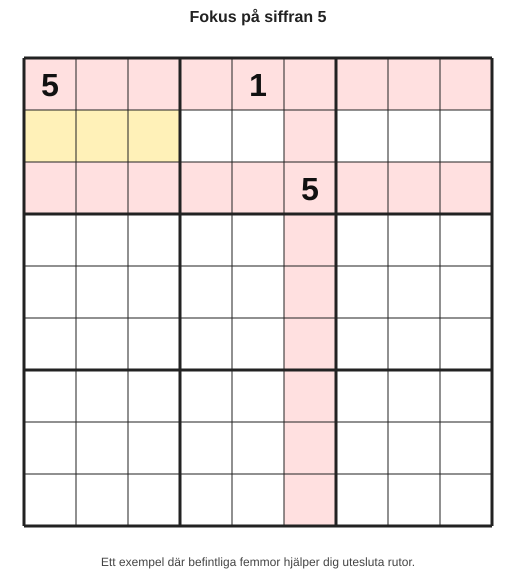
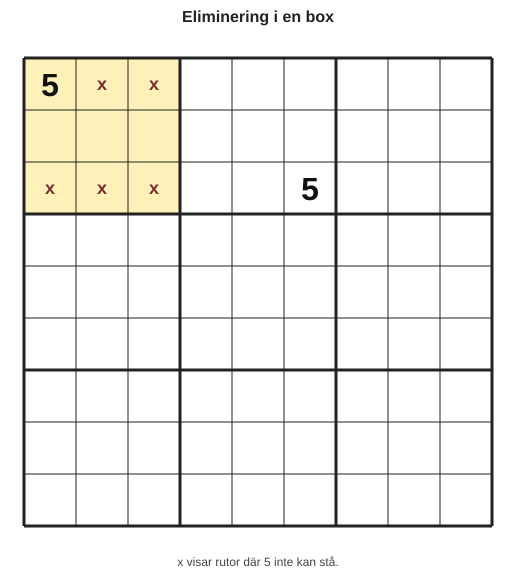
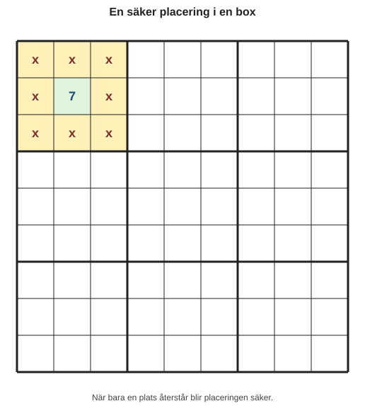
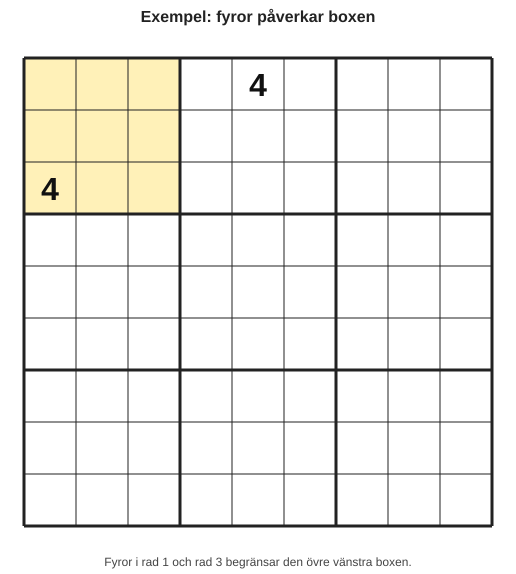
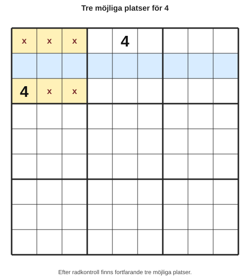
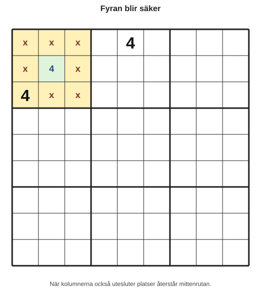
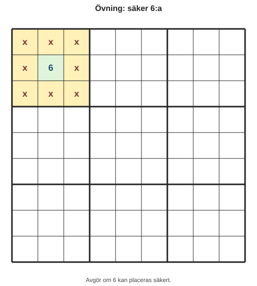
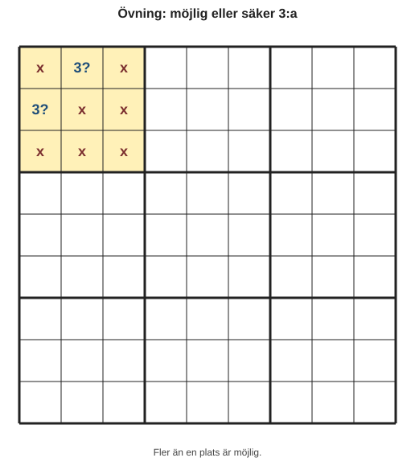
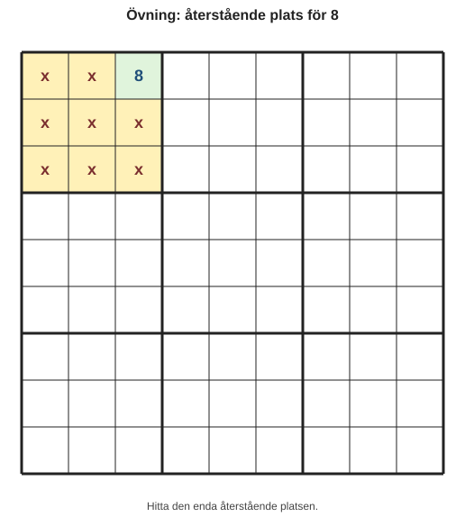

# Kapitel 2: Börja med enkla siffror

## Varför detta kapitel finns

Nu när du känner igen rutnätet, raderna, kolumnerna och boxarna är nästa steg att faktiskt placera siffror. Det viktigaste i början är att bara skriva in en siffra när du vet att den måste stå där.

I det här kapitlet tränar vi på två grundidéer:

- **Eliminering:** att ta bort platser där en siffra inte kan stå.
- **Säker placering:** att hitta en ruta där en siffra logiskt måste placeras.

Målet är inte att lösa ett helt sudoku direkt. Målet är att lära sig se de första säkra dragen.

## Lärandemål

Efter kapitlet ska läsaren kunna:

- använda rader, kolumner och boxar för att utesluta omöjliga placeringar,
- hitta enkla säkra placeringar,
- förklara varför en siffra måste stå i en viss ruta,
- undvika att gissa när det saknas tillräcklig information.

## Innan vi börjar

Från kapitel 1 tar vi med oss tre områden:

- En **rad** går vågrätt.
- En **kolumn** går lodrätt.
- En **box** är ett 3×3-område.

Sudokuns grundregel är att varje rad, kolumn och box ska innehålla siffrorna 1–9 utan upprepning. När vi placerar en siffra måste den alltså passa i alla tre områden samtidigt.

## Huvudförklaring

### Vad betyder eliminering?

Eliminering betyder att vi frågar: “Var kan den här siffran inte stå?”

Anta att vi letar efter siffran 5 i en box. Om en rad redan innehåller 5 kan ingen tom ruta i samma rad innehålla en ny 5. Om en kolumn redan innehåller 5 kan ingen tom ruta i samma kolumn innehålla en ny 5.

När tillräckligt många rutor utesluts återstår ibland bara en möjlig plats. Då har vi hittat en säker placering.

### Ett litet exempel

Titta på den markerade boxen uppe till vänster.

*Figur 2.1: Befintliga femmor hjälper dig att utesluta möjliga rutor i den markerade boxen.*

I den vänstra övre boxen finns redan en 5 i första raden. Det betyder att de andra tomma rutorna i samma rad inte kan vara 5. Det finns också en 5 i tredje raden, sjätte kolumnen. Det påverkar tredje raden.

För att göra exemplet lättare kan vi markera vilka rutor i den vänstra övre boxen som inte kan innehålla 5:

*Figur 2.2: x visar rutor där 5 inte kan stå. De omarkerade rutorna kan fortfarande vara möjliga.*

Vi har alltså inte en säker placering ännu.

Det här är viktigt: ibland leder eliminering direkt till ett svar, ibland leder den bara till bättre förståelse.

### När blir placeringen säker?

En placering är säker när bara en möjlig ruta återstår.

Titta på den här boxen:

*Figur 2.3: När alla andra platser är uteslutna blir mittenrutan säker.*

Om vi letar efter siffran 7 och alla rutor utom mitten är uteslutna, då måste 7 stå i mittenrutan. Det är en säker placering.

Du behöver inte gissa. Du kan säga:

> “Siffran 7 kan inte stå i någon annan ruta i boxen. Därför måste den stå här.”

Det är kärnan i logisk sudokulösning.

## Exempel

Vi tränar på siffran 4 i den övre vänstra boxen.

*Figur 2.4: Fyror i rad 1 och rad 3 påverkar den övre vänstra boxen.*

Vi undersöker bara den övre vänstra boxen.

- Rad 1 innehåller redan 4, så ingen annan ruta på rad 1 kan vara 4.
- Rad 3 innehåller redan 4, så ingen annan ruta på rad 3 kan vara 4.

Då återstår bara rutorna på rad 2 i den boxen:

*Figur 2.5: Efter radkontroll finns fortfarande tre möjliga platser för 4.*

Det finns fortfarande tre möjliga platser. Det är inte tillräckligt för att placera en 4.

Men om vi får mer information från kolumnerna kan läget ändras:

*Figur 2.6: När kolumnerna också utesluter platser återstår mittenrutan.*

Nu återstår bara mittenrutan i boxen. Då kan vi placera 4 där.

Det här är ett enkelt men kraftfullt mönster: använd rader och kolumner för att minska antalet möjliga platser i en box.

## Ett praktiskt arbetssätt

När du börjar lösa ett sudoku kan du använda den här ordningen:

1. Välj en siffra, till exempel 1.
2. Titta på en box i taget.
3. Fråga: “Vilka rader och kolumner hindrar den här siffran?”
4. Markera mentalt vilka rutor som inte fungerar.
5. Skriv bara in siffran om exakt en möjlig ruta återstår.
6. Gå vidare till nästa box eller nästa siffra.

Det är ofta lättare att leta efter en siffra som redan finns många gånger i rutnätet. Om det redan finns flera femmor är det ofta enklare att hitta var nästa femma måste stå.

## Vanliga misstag

- **Misstag: Att skriva in en siffra för att den verkar trolig.**
  - Varför det händer: Rutan känns “nästan säker”.
  - Hur man undviker det: Kräv alltid en tydlig förklaring: “Den kan inte stå någon annanstans eftersom ...”

- **Misstag: Att bara titta på boxen.**
  - Varför det händer: Boxen är visuellt tydligast.
  - Hur man undviker det: Kontrollera alltid rad och kolumn också.

- **Misstag: Att blanda ihop möjlig placering och säker placering.**
  - Varför det händer: En möjlig ruta kan kännas som ett svar.
  - Hur man undviker det: En siffra är säker först när alla andra alternativ är uteslutna.

## Övningar

### Övning 1: Är placeringen säker?

Du letar efter siffran 6 i en box.

*Figur 2.7: Avgör om 6 kan placeras säkert.*

Fråga: Kan du placera 6 i mittenrutan? Förklara varför.

### Övning 2: Möjligt eller säkert?

Du letar efter siffran 3 i en box.

*Figur 2.8: Fler än en plats är möjlig.*

Fråga: Kan du placera 3 direkt? Varför eller varför inte?

### Övning 3: Hitta återstående plats

Du letar efter siffran 8 i en box.

*Figur 2.9: Hitta den enda återstående platsen.*

Fråga: Var måste 8 stå?

### Fördjupning

Välj en siffra mellan 1 och 9 i ett enkelt sudoku. Gå igenom rutnätet box för box och leta efter platser där siffran bara kan stå på en enda plats. Skriv inte in något om du inte kan förklara placeringen med rad, kolumn och box.

## Snabb sammanfattning

- Eliminering betyder att utesluta omöjliga placeringar.
- En säker placering finns när bara en möjlig ruta återstår.
- En möjlig placering är inte samma sak som en säker placering.
- Titta alltid på rad, kolumn och box innan du skriver in en siffra.
- Gissning är inte en strategi i den här boken.

## Quiz/reflektionsfrågor

1. Vad betyder eliminering i sudoku?
2. När är en placering säker?
3. Varför räcker det inte att en siffra “kan” stå i en ruta?
4. Vilka tre områden ska du kontrollera innan du placerar en siffra?
5. Vad bör du göra om två möjliga rutor återstår?

## Nästa steg

I nästa kapitel lär du dig att arbeta med **kandidater**. Kandidater hjälper dig att hålla ordning när en ruta har flera möjliga siffror och gör det lättare att lösa svårare sudoku utan att gissa.
