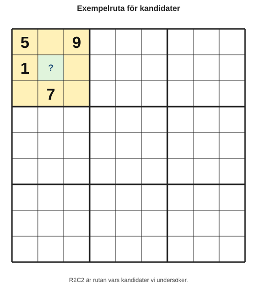
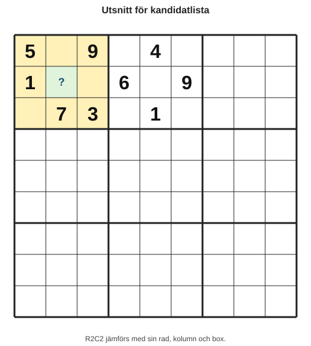
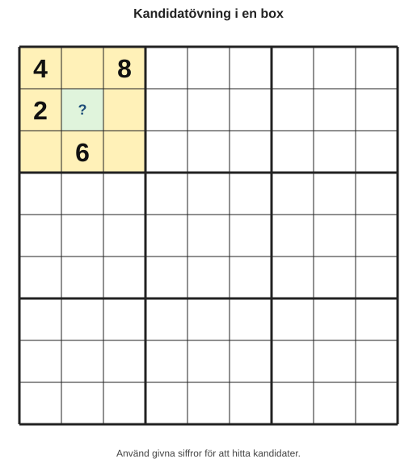

# Kapitel 3: Anteckningar och kandidater

## Varför detta kapitel finns

I kapitel 2 tränade du på att hitta säkra placeringar genom eliminering: en siffra kunde bara passa på en plats. Det är en stark metod, men den räcker inte alltid.

När ett sudoku blir lite svårare behöver du kunna hålla reda på flera möjliga siffror utan att tappa överblicken. Det är här anteckningar och kandidater kommer in.

En **kandidat** är en siffra som fortfarande kan passa i en tom ruta. En **kandidatlista** är listan över alla sådana möjliga siffror för just den rutan.

Målet är inte att anteckna så mycket som möjligt. Målet är att anteckna tillräckligt för att kunna tänka klart.

## Lärandemål

Efter kapitlet ska läsaren kunna:

- förklara vad en kandidat är,
- skapa en kandidatlista för en tom ruta,
- ta bort kandidater med hjälp av rad, kolumn och box,
- skilja mellan en möjlig kandidat och en säker placering,
- använda anteckningar utan att göra rutnätet rörigt.

## Innan vi börjar

Du behöver komma ihåg tre regler från kapitel 1:

- Varje rad ska innehålla siffrorna 1–9.
- Varje kolumn ska innehålla siffrorna 1–9.
- Varje box ska innehålla siffrorna 1–9.

Du behöver också komma ihåg skillnaden från kapitel 2:

- En **möjlig placering** kan fungera.
- En **säker placering** måste vara rätt enligt logiken.

Kandidater hjälper dig att se möjliga placeringar. De är inte samma sak som svar.

## Huvudförklaring

### Vad är en kandidat?

Tänk dig en tom ruta. I början kan den, teoretiskt, innehålla någon av siffrorna 1–9.

Men rutan påverkas av sin rad, sin kolumn och sin box. Om siffran 5 redan finns i samma rad kan rutan inte vara 5. Om siffran 2 redan finns i samma kolumn kan rutan inte vara 2. Om siffran 8 redan finns i samma box kan rutan inte vara 8.

De siffror som inte utesluts är rutans kandidater.

### En enkel metod för kandidatlistor

För en tom ruta kan du använda denna arbetsgång:

1. Börja med siffrorna 1–9.
2. Stryk siffror som redan finns i samma rad.
3. Stryk siffror som redan finns i samma kolumn.
4. Stryk siffror som redan finns i samma box.
5. Skriv kvarvarande siffror som kandidatlista.

Det viktiga är att göra detta lugnt och i samma ordning varje gång.

### Exempelruta

Titta på denna ruta, markerad med **?**.

*Figur 3.1: R2C2 är rutan vars kandidater vi undersöker.*

Anta att rutan **?** också ligger i:

- en rad där siffrorna 1 och 4 redan finns,
- en kolumn där siffrorna 2 och 7 redan finns,
- en box där siffrorna 1, 3, 5, 7 och 9 redan finns.

Vi börjar med alla siffror:

| Start | 1 | 2 | 3 | 4 | 5 | 6 | 7 | 8 | 9 |
|---|---|---|---|---|---|---|---|---|---|
| Möjlig? | x | x | x | x | x | ja | x | ja | x |

Kandidatlistan blir alltså:

**6, 8**

Det betyder inte att rutan säkert är 6 eller säkert är 8. Det betyder bara att de andra siffrorna inte kan stå där.

### När blir en kandidat ett svar?

En kandidat blir ett svar när logiken visar att ingen annan möjlighet finns.

Om en ruta bara har en kandidat kvar, till exempel:

| Ruta | Kandidater |
|---|---|
| R2C2 | 6 |

då är placeringen säker. Rutan måste vara 6.

Men om kandidatlistan är:

| Ruta | Kandidater |
|---|---|
| R2C2 | 6, 8 |

då ska du vänta. Du vet ännu inte vilken av siffrorna som är rätt.

## Exempel

Vi använder ett litet utsnitt av ett sudoku.

*Figur 3.2: R2C2 jämförs med sin rad, kolumn och box.*

Vi ska hitta kandidater för rutan R2C2.

### Steg 1: Börja med 1–9

| Ruta | Startkandidater |
|---|---|
| R2C2 | 1, 2, 3, 4, 5, 6, 7, 8, 9 |

### Steg 2: Titta på raden

Rad 2 innehåller 1, 6 och 9.

Därför kan R2C2 inte vara 1, 6 eller 9.

| Ruta | Kvar efter raden |
|---|---|
| R2C2 | 2, 3, 4, 5, 7, 8 |

### Steg 3: Titta på kolumnen

Kolumn 2 innehåller 7.

Därför kan R2C2 inte vara 7.

| Ruta | Kvar efter raden och kolumnen |
|---|---|
| R2C2 | 2, 3, 4, 5, 8 |

### Steg 4: Titta på boxen

Den vänstra övre boxen innehåller 5, 9, 1, 7 och 3.

Därför kan R2C2 inte vara 5, 9, 1, 7 eller 3.

| Ruta | Slutlig kandidatlista |
|---|---|
| R2C2 | 2, 4, 8 |

R2C2 har alltså kandidaterna **2, 4 och 8**.

Det är användbar information, men det är inte ett svar ännu.

## Hur mycket ska man anteckna?

Det finns två vanliga sätt att använda anteckningar.

### Lätta anteckningar

Du skriver bara kandidater när de verkar viktiga.

Det passar när sudokut är ganska enkelt och du fortfarande hittar många säkra placeringar.

### Fulla anteckningar

Du skriver kandidater för många eller alla tomma rutor.

Det passar när sudokut är svårare eller när du vill träna metodiskt.

I den här boken börjar vi med lätta anteckningar och går gradvis mot mer systematiska kandidatlistor. Det gör att du lär dig tänka, inte bara fylla rutor med små siffror.

## Vanliga misstag

### Misstag 1: Att skriva in en kandidat som om den vore ett svar

- Misstag: Du ser att en ruta kan vara 6 och skriver in 6 direkt.
- Varför det händer: Hjärnan vill snabbt hitta ett svar.
- Hur du undviker det: Fråga alltid: är detta den enda möjliga siffran, eller bara en möjlig siffra?

### Misstag 2: Att glömma boxen

- Misstag: Du kontrollerar rad och kolumn men glömmer 3×3-boxen.
- Varför det händer: Rader och kolumner är lättare att följa med ögat.
- Hur du undviker det: Använd alltid ordningen rad, kolumn, box.

### Misstag 3: Att anteckna för mycket för tidigt

- Misstag: Du fyller hela rutnätet med kandidater och tappar överblicken.
- Varför det händer: Det känns tryggt att skriva ner allt.
- Hur du undviker det: Börja med rutor där många siffror redan är uteslutna.

### Misstag 4: Att inte uppdatera kandidater

- Misstag: Du placerar en ny siffra men låter gamla kandidater stå kvar.
- Varför det händer: Anteckningar känns statiska.
- Hur du undviker det: När du skriver in en säker siffra, kontrollera samma rad, kolumn och box.

## Övningar

### Övning 1: Hitta kandidater för en ruta

Rutan R2C2 är tom.

*Figur 3.3: Använd givna siffror för att hitta kandidater i den markerade rutan.*

Anta att R2C2 ligger i samma rad som siffrorna 2 och 5, samma kolumn som 1 och 6, och samma box som 2, 4, 6, 8 och 9.

Skriv kandidatlistan för R2C2.

### Övning 2: Kandidat eller säker placering?

För varje rad, avgör om rutan har en säker placering.

| Ruta | Kandidater | Säker placering? |
|---|---|---|
| A | 3 |  |
| B | 2, 7 |  |
| C | 1, 4, 9 |  |
| D | 8 |  |

### Övning 3: Stryk kandidater

En tom ruta har först kandidaterna:

**1, 2, 3, 4, 5, 6, 7, 8, 9**

I samma rad finns 3 och 8. I samma kolumn finns 1 och 6. I samma box finns 2, 5 och 9.

Vilka kandidater återstår?

### Fördjupning

Välj en tom ruta i ett sudoku du själv har hemma eller hittar i en tidning. Skriv kandidatlistan för rutan genom att använda ordningen:

1. rad,
2. kolumn,
3. box.

Skriv också en kort motivering: “Rutan kan vara ... eftersom ... är uteslutna.”

## Facit till övningarna

### Facit 1

Start: 1–9.

Uteslutna siffror:

- rad: 2, 5,
- kolumn: 1, 6,
- box: 2, 4, 6, 8, 9.

Kvar blir:

**3, 7**

### Facit 2

| Ruta | Kandidater | Säker placering? |
|---|---|---|
| A | 3 | Ja, rutan måste vara 3. |
| B | 2, 7 | Nej, båda är fortfarande möjliga. |
| C | 1, 4, 9 | Nej, tre möjligheter finns kvar. |
| D | 8 | Ja, rutan måste vara 8. |

### Facit 3

Uteslutna siffror är 1, 2, 3, 5, 6, 8 och 9.

Kvar blir:

**4, 7**

## Snabb sammanfattning

- En kandidat är en möjlig siffra för en tom ruta.
- En kandidatlista visar alla siffror som fortfarande kan passa.
- Kandidater skapas genom att utesluta siffror från rad, kolumn och box.
- En kandidat är inte automatiskt ett svar.
- En ruta med endast en kandidat kvar är en säker placering.
- Bra anteckningar ska hjälpa tanken, inte skapa rörighet.

## Quiz och reflektionsfrågor

1. Vad är skillnaden mellan en kandidat och en säker placering?
2. Vilka tre områden ska du kontrollera när du skapar en kandidatlista?
3. Varför är det riskabelt att skriva in en siffra bara för att den är möjlig?
4. När kan fulla anteckningar vara mer användbara än lätta anteckningar?
5. Vad bör du göra med kandidatlistor när du placerar en ny säker siffra?

## Nästa steg

Nu kan du skapa kandidatlistor och förstå vad anteckningar faktiskt betyder. I nästa kapitel använder vi kandidaterna för att hitta vanliga nybörjarstrategier, till exempel scanning, enkla singlar och dolda singlar.
