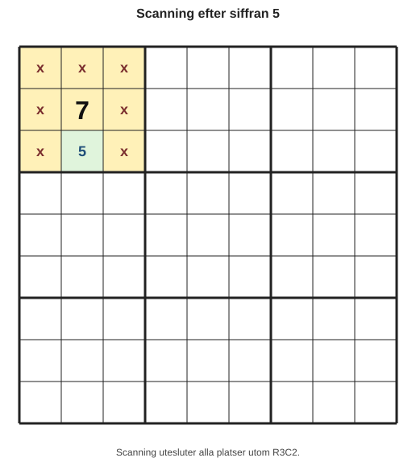
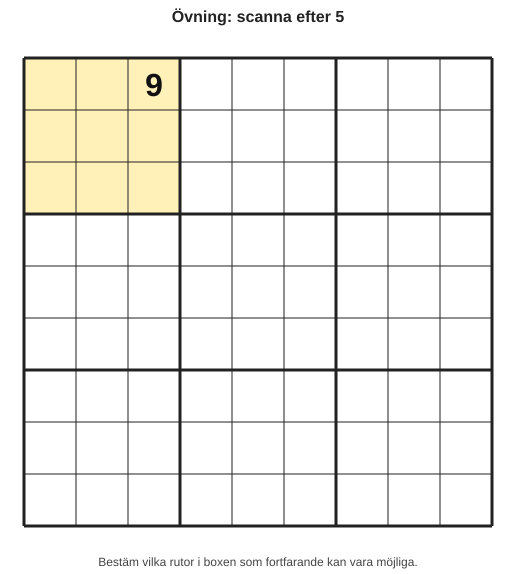

# Kapitel 4: Vanliga nybörjarstrategier

## Varför detta kapitel finns

Nu har du lärt dig sudokuns regler, hur du hittar säkra placeringar och hur kandidater kan hjälpa dig att hålla ordning. I det här kapitlet samlar vi de första riktiga strategierna som många nybörjare använder när de börjar lösa sudoku mer metodiskt.

Målet är inte att lösa svåra sudoku snabbt. Målet är att du ska få en trygg arbetsmetod: titta, uteslut, jämför och placera först när du har en tydlig logisk anledning.

## Lärandemål

Efter kapitlet ska läsaren kunna:

- använda scanning för att leta efter möjliga placeringar för en siffra,
- känna igen en enkel singel,
- känna igen en dold singel,
- förklara varför en placering är säker,
- välja en lugn arbetsordning när flera strategier kan användas.

## Innan vi börjar

I kapitel 2 lärde du dig skillnaden mellan en **möjlig placering** och en **säker placering**. I kapitel 3 lärde du dig att en **kandidat** är en möjlig siffra, inte ett färdigt svar.

Det här kapitlet bygger på samma regel:

> Skriv inte in en siffra för att den verkar passa. Skriv in den när du kan förklara varför den måste stå där.

## Tre strategier du kommer långt med

I början räcker det ofta med tre strategier:

| Strategi | Fråga du ställer | Vad du letar efter |
|---|---|---|
| Scanning | Var kan den här siffran finnas? | Rutor som blockeras av samma siffra i rader, kolumner och boxar. |
| Enkel singel | Vilken siffra kan stå i den här rutan? | En ruta som bara har en kandidat kvar. |
| Dold singel | Var kan den här siffran stå i den här gruppen? | En siffra som bara har en möjlig plats i en rad, kolumn eller box. |

En **grupp** betyder här en rad, en kolumn eller en box. Alla tre innehåller nio rutor och ska innehålla siffrorna 1–9 exakt en gång.

## Strategi 1: Scanning

Scanning betyder att du väljer en siffra, till exempel 5, och söker efter var den siffran kan placeras. Du använder redan ifyllda femmor för att utesluta rutor i samma rad, kolumn och box.

Tänk så här:

1. Välj en siffra.
2. Titta på var siffran redan finns.
3. Uteslut rader, kolumner och boxar där siffran redan påverkar tomma rutor.
4. Leta efter en box, rad eller kolumn där bara en möjlig plats återstår.

### Exempel: scanna efter siffran 5

I det här utsnittet tittar vi på den övre vänstra boxen.

Anta samtidigt att:

- det redan finns en 5 i rad 1,
- det redan finns en 5 i kolumn 1,
- det redan finns en 5 i kolumn 3.

Då kan vi markera uteslutna rutor med `x`.

*Figur 4.1: Scanning utesluter alla platser utom R3C2.*

Den enda platsen som återstår för 5 i den här boxen är R3C2. Då är R3C2 en säker placering.

Lägg märke till att vi inte gissade. Vi tittade på alla möjliga platser i boxen och såg att bara en plats fungerade.

## Strategi 2: Enkel singel

En **enkel singel** uppstår när en tom ruta bara har en kandidat kvar.

Det betyder att du tittar på en viss ruta och frågar:

> Vilka siffror kan stå här?

Om svaret bara är en enda siffra, kan du skriva in den.

### Exempel: en ruta med en kandidat kvar

Anta att rutan R4K6 påverkas av följande siffror:

| Påverkan från | Siffror som redan finns |
|---|---|
| Raden | 1, 2, 4 |
| Kolumnen | 3, 5, 8 |
| Boxen | 6, 7 |

Då är siffrorna 1, 2, 3, 4, 5, 6, 7 och 8 redan uteslutna. Den enda siffran som saknas är 9.

| Ruta | Kandidater |
|---|---|
| R4K6 | **9** |

Alltså måste R4K6 vara 9.

En enkel singel är ofta lätt att missa om du inte använder kandidater. Därför är anteckningar från kapitel 3 ett bra stöd.

## Strategi 3: Dold singel

En **dold singel** är lite annorlunda. Här kan en ruta ha flera kandidater, men en viss siffra kan bara stå på en enda plats i hela gruppen.

Det betyder att du inte bara tittar på en ruta. Du tittar på en rad, kolumn eller box och frågar:

> Var kan siffran 8 stå i den här gruppen?

### Exempel: dold singel i en rad

Titta på kandidatlistorna för en rad:

| Ruta | R5K1 | R5K2 | R5K3 | R5K4 | R5K5 |
|---|---|---|---|---|---|
| Kandidater | 2, 8 | 2, 4 | 4, 6 | 1, 6 | 3, 5 |

Här har R5K1 två kandidater: 2 och 8. Rutan är alltså inte en enkel singel.

Men om vi frågar var siffran 8 kan stå i raden, ser vi att 8 bara finns i en kandidatlista: R5K1.

Då är R5K1 en dold singel och måste vara 8.

| Slutsats | Motivering |
|---|---|
| R5K1 = **8** | 8 kan bara stå på en plats i rad 5. |

Den är “dold” eftersom rutan inte såg färdig ut när vi bara tittade på rutan. Den blev tydlig först när vi jämförde hela raden.

## Enkel singel och dold singel är inte samma sak

Det är vanligt att blanda ihop de två. Skillnaden är viktig.

| Strategi | Du tittar på | Tecken på lösning |
|---|---|---|
| Enkel singel | En ruta | Rutan har bara en kandidat. |
| Dold singel | En hel rad, kolumn eller box | En viss siffra kan bara stå i en ruta i gruppen. |

Ett bra sätt att komma ihåg skillnaden:

- Enkel singel: “Den här rutan har bara ett val.”
- Dold singel: “Den här siffran har bara en plats.”

## En lugn arbetsordning

När du löser ett sudoku kan du använda strategierna i den här ordningen:

1. Scanna siffror som redan förekommer ofta.
2. Leta efter enkla singlar i rutor med många ifyllda grannar.
3. Jämför kandidatlistor för att hitta dolda singlar.
4. Skriv alltid en kort motivering innan du fyller i en siffra.
5. Uppdatera kandidaterna efter varje placering.

Du behöver inte göra detta perfekt. Det viktiga är att du inte hoppar slumpmässigt mellan rutor utan plan.

## Exempel: välj nästa säkra steg

Här är ett förenklat kandidatutsnitt från en box:

| Ruta | Kandidater |
|---|---|
| R1K1 | 2, 6 |
| R1K2 | 2, 6, 9 |
| R1K3 | 4, 9 |
| R2K1 | 1, 4 |
| R2K2 | 1, 3, 4 |
| R2K3 | 3, 4 |
| R3K1 | 5, 7 |
| R3K2 | 5, 7 |
| R3K3 | 8 |

Den tydligaste placeringen är R3K3 = 8, eftersom rutan bara har en kandidat. Det är en enkel singel.

Efter att du skriver in 8 ska du ta bort 8 som kandidat från samma rad, kolumn och box. I det här lilla utsnittet finns inga andra åttor, men i ett helt sudoku kan uppdateringen skapa nya singlar.

## Vanliga misstag

- **Misstag: att skriva in en siffra bara för att den passar.**
  - Varför det händer: Rutan verkar rimlig och inga regler bryts direkt.
  - Hur man undviker det: Kräv en motivering som visar att siffran måste stå där.

- **Misstag: att bara leta i en ruta i taget.**
  - Varför det händer: Kandidatlistor gör att blicken fastnar på enskilda rutor.
  - Hur man undviker det: Växla mellan rutor och grupper. Fråga både “vad kan stå här?” och “var kan den här siffran stå?”.

- **Misstag: att glömma uppdatera kandidater.**
  - Varför det händer: Efter en placering går man direkt vidare.
  - Hur man undviker det: Gör uppdatering till en fast del av varje steg.

## Övningar

### Övning 1: hitta enkel singel

Vilken ruta är en enkel singel?

| Ruta | Kandidater |
|---|---|
| A | 1, 4 |
| B | 3, 7 |
| C | 6 |
| D | 2, 5, 8 |

Skriv både rutan och siffran.

### Övning 2: hitta dold singel

I en rad finns följande kandidater:

| Ruta | R7K1 | R7K2 | R7K3 | R7K4 |
|---|---|---|---|---|
| Kandidater | 1, 5 | 1, 3 | 3, 8 | 2, 5 |

Vilken siffra är dold singel, och i vilken ruta?

### Övning 3: scanna en box

I en box ska du placera siffran 4.

*Figur 4.2: Använd antagandena nedan för att räkna bort omöjliga platser.*

Anta att:

- rad 1 redan innehåller en 4,
- kolumn 4 redan innehåller en 4,
- kolumn 6 redan innehåller en 4,
- rad 3 redan innehåller en 4.

Vilken ruta återstår för 4 i boxen?

### Fördjupning

Välj ett enkelt sudoku från en tidning eller app. Lös inte hela. Gör bara detta:

1. Välj siffran 1 och scanna alla boxar.
2. Skriv ner varje säker placering du hittar.
3. Upprepa med siffran 2.
4. Stanna efter två siffror och kontrollera att varje placering har en tydlig motivering.

## Facit och kommentarer

### Facit till övning 1

Ruta C är en enkel singel. Den enda kandidaten är 6.

### Facit till övning 2

Siffran 8 är en dold singel i R7K3. Den syns bara i en kandidatlista i raden.

### Facit till övning 3

R2K5 återstår för 4.

Så här kan du resonera:

- Rad 1 blockerar R1K4 och R1K5.
- Kolumn 4 blockerar R2K4 och R3K4.
- Kolumn 6 blockerar R2K6 och R3K6.
- Rad 3 blockerar R3K5.
- R1K6 är redan ifylld med 9.
- Den enda tomma rutan som inte blockeras är R2K5.

## Snabb sammanfattning

- Scanning betyder att du söker efter möjliga platser för en vald siffra.
- En enkel singel är en ruta med bara en kandidat.
- En dold singel är en siffra som bara kan stå på en plats i en grupp.
- Kontrollera alltid om du tittar på en ruta eller på en hel grupp.
- Uppdatera kandidater efter varje säker placering.

## Quiz/reflektionsfrågor

1. Vad är skillnaden mellan en enkel singel och en dold singel?
2. Varför är scanning ofta lättare att börja med än mer avancerade strategier?
3. Vad bör du göra direkt efter att du placerat en säker siffra?
4. Hur kan du kontrollera att du inte har gissat?

## Nästa steg

I nästa kapitel ska vi bygga vidare på strategierna och skapa en tydlig arbetsordning. Du får lära dig hur du gör en lösningsrunda, när du ska kontrollera kandidater och hur du minskar risken för slarvfel.
