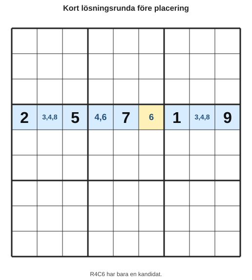
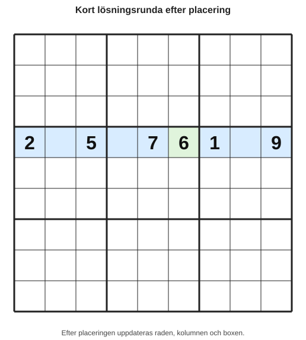

# Kapitel 5: Arbeta systematiskt

## Varför detta kapitel finns

När du har lärt dig flera strategier kan ett nytt problem uppstå: du vet ungefär vad du ska leta efter, men inte i vilken ordning. Då är det lätt att hoppa runt i rutnätet, missa enkla steg eller börja gissa när lösningen egentligen finns framför dig.

Det här kapitlet handlar om arbetsordning. Du ska lära dig att lösa sudoku mer som en lugn undersökning än som en jakt. Målet är att du alltid ska veta vad nästa rimliga steg är.

## Lärandemål

Efter kapitlet ska läsaren kunna:

- använda en enkel lösningsrunda,
- lägga in kontrollpunkter för att upptäcka misstag tidigt,
- välja nästa steg utan att hoppa planlöst,
- dokumentera varför en siffra placeras,
- använda en kort arbetsrutin när ett sudoku känns rörigt.

## Innan vi börjar

I tidigare kapitel har du lärt dig tre viktiga saker:

- En **säker placering** är en siffra som logiskt måste stå på en viss plats.
- En **kandidat** är en möjlig siffra, inte ett färdigt svar.
- En **grupp** är en rad, kolumn eller box.

Nu ska vi använda dessa idéer i en tydligare arbetsordning.

## Varför systematik hjälper

Många nybörjare gör samma sak: de tittar på en ruta, sedan en annan, sedan en box, sedan tillbaka till första rutan. Det kan fungera i enkla sudoku, men det blir snabbt tröttande.

En systematisk metod hjälper dig att:

| Problem | Systematisk lösning |
|---|---|
| Du missar enkla placeringar. | Gå igenom siffrorna i samma ordning varje gång. |
| Du antecknar för mycket. | Uppdatera kandidater först efter säkra placeringar. |
| Du blir osäker på vad du nyss gjorde. | Skriv en kort motivering till viktiga steg. |
| Du börjar gissa. | Stanna vid en kontrollpunkt och byt strategi. |

Systematik gör inte att varje sudoku blir lätt. Men den gör att du arbetar lugnare och gör färre onödiga misstag.

## Begrepp 1: Lösningsrunda

En **lösningsrunda** är ett planerat varv genom rutnätet. I stället för att hoppa slumpmässigt bestämmer du i förväg vad du ska leta efter.

En enkel lösningsrunda kan se ut så här:

1. Scanna siffrorna 1–9.
2. Leta efter enkla singlar.
3. Leta efter dolda singlar i rader.
4. Leta efter dolda singlar i kolumner.
5. Leta efter dolda singlar i boxar.
6. Uppdatera kandidater efter varje säker placering.
7. Gör en kontrollpunkt.

Du behöver inte alltid följa listan exakt. Men när du kör fast är den ett bra sätt att komma tillbaka till ordning.

## Exempel: en kort lösningsrunda

Anta att du arbetar med den här raden.

*Figur 5.1: R4C6 har bara en kandidat och kan därför placeras säkert.*

Siffrorna som saknas i raden är 3, 4, 6 och 8. R4C6 har bara en kandidat. Det är en enkel singel.

Efter placeringen uppdaterar du raden:

*Figur 5.2: Efter placeringen uppdateras raden, kolumnen och boxen.*

Nu gör du inte tio nya saker samtidigt. Du uppdaterar först kandidaterna i samma rad, kolumn och box. Sedan fortsätter du lösningsrundan.

## Begrepp 2: Kontrollpunkt

En **kontrollpunkt** är en kort paus där du kontrollerar att allt fortfarande stämmer.

En bra kontrollpunkt kan vara:

| Fråga | Varför den är viktig |
|---|---|
| Har jag skrivit samma siffra två gånger i en rad? | Det bryter mot sudoku-regeln. |
| Har jag samma siffra två gånger i en kolumn? | Det visar att något gått fel. |
| Har jag samma siffra två gånger i en box? | Det är ett tidigt varningstecken. |
| Har jag tagit bort kandidater av rätt skäl? | Fel kandidatborttagning kan låsa hela lösningen. |
| Kan jag förklara senaste placeringen? | Om inte kan den ha varit en gissning. |

Kontrollpunkter ska vara korta. De är inte till för att börja om från början, utan för att upptäcka små fel innan de växer.

## En enkel arbetsrutin

Här är en arbetsrutin som passar bokens nivå:

1. Titta först efter uppenbara säkra placeringar.
2. Scanna siffrorna 1–9.
3. Fyll i eller uppdatera kandidater där rutnätet är trångt.
4. Leta efter enkla singlar.
5. Leta efter dolda singlar i en grupp i taget.
6. Placera bara siffror du kan motivera.
7. Gör en kontrollpunkt efter några placeringar.
8. Upprepa från början.

Det viktiga är inte att bli snabb. Det viktiga är att alltid kunna svara på frågan:

> Varför vet jag att den här siffran ska stå här?

## Hur du väljer nästa bästa steg

När flera saker verkar möjliga kan du använda denna prioritering:

| Situation | Rekommenderat nästa steg |
|---|---|
| En ruta har bara en kandidat. | Placera enkel singel. |
| En siffra kan bara stå på en plats i en grupp. | Placera dold singel. |
| En box har få tomma rutor. | Gå igenom boxen noggrant. |
| En rad eller kolumn nästan är klar. | Kontrollera saknade siffror. |
| Rutnätet känns rörigt. | Gör en kontrollpunkt och börja en ny lösningsrunda. |

Den här prioriteringen hjälper dig att ta enkla vinster först. Varje säker placering kan öppna nya möjligheter.

## Vanliga misstag

- **Misstag: Att hoppa mellan strategier för snabbt.**
  - Varför det händer: Du ser många tomma rutor och vill hitta lösningen snabbt.
  - Hur man undviker det: Bestäm vilken strategi du använder just nu och avsluta den innan du byter.

- **Misstag: Att glömma uppdatera kandidater.**
  - Varför det händer: En placering känns klar, men dess följder missas.
  - Hur man undviker det: Efter varje säker placering, titta alltid i samma rad, kolumn och box.

- **Misstag: Att kalla en möjlig placering för säker.**
  - Varför det händer: En siffra passar bra, men är inte bevisad.
  - Hur man undviker det: Kräv en kort motivering innan du skriver in siffran.

- **Misstag: Att kontrollera för sällan.**
  - Varför det händer: Du vill fortsätta när det går bra.
  - Hur man undviker det: Lägg en kontrollpunkt efter tre till fem placeringar.

## Övningar

### Övning 1: Välj rätt nästa steg

Du ser följande kandidatlista:

| Ruta | Kandidater |
|---|---|
| R2K1 | 2, 5 |
| R2K4 | 5 |
| R2K7 | 2, 8 |
| R2K9 | 2, 5, 8 |

Vilken ruta bör du börja med, och varför?

### Övning 2: Hitta kontrollpunkten

Du har just placerat tre siffror i ett sudoku. Vilka tre saker bör du kontrollera innan du fortsätter?

### Övning 3: Skapa en lösningsrunda

Skriv en egen lösningsrunda med fem steg. Den ska passa dig som nybörjare och innehålla minst en kontrollpunkt.

### Övning 4: Är detta en säker placering?

En ruta har kandidaterna 3 och 7. Du tycker att 7 verkar passa bäst eftersom raden nästan är klar.

Får du skriva in 7 direkt? Förklara ditt svar.

### Fördjupning

Prova att lösa ett enkelt sudoku och skriv en kort notering efter varje placering:

- Vilken ruta fyllde du i?
- Vilken strategi använde du?
- Varför var placeringen säker?

Du behöver inte skriva långt. En rad per placering räcker.

## Snabb sammanfattning

- En lösningsrunda är ett planerat varv genom rutnätet.
- En kontrollpunkt är en kort paus där du kontrollerar att reglerna fortfarande håller.
- Systematik hjälper dig att undvika gissningar och slarvfel.
- Efter varje säker placering ska kandidater i samma rad, kolumn och box uppdateras.
- När du kör fast är det ofta bättre att börja en ny lösningsrunda än att stirra på samma ruta.

## Quiz/reflektionsfrågor

1. Vad är skillnaden mellan en lösningsrunda och att bara titta runt i rutnätet?
2. Varför är kontrollpunkter särskilt viktiga för nybörjare?
3. Vad bör du göra direkt efter en säker placering?
4. Varför är frågan “kan jag förklara placeringen?” så viktig?
5. När är det bättre att börja om med en ny lösningsrunda?

## Nästa steg

Nu har du en arbetsmetod för att använda de grundläggande strategierna mer kontrollerat. I nästa kapitel går vi vidare till par och låsta möjligheter. Där börjar du inte bara hitta siffror som ska placeras, utan också ta bort kandidater med mer avancerad logik.
