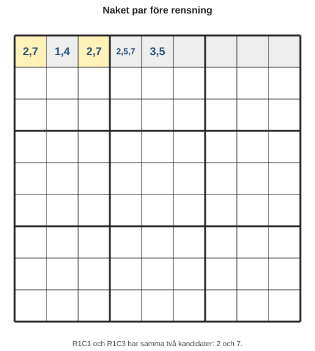
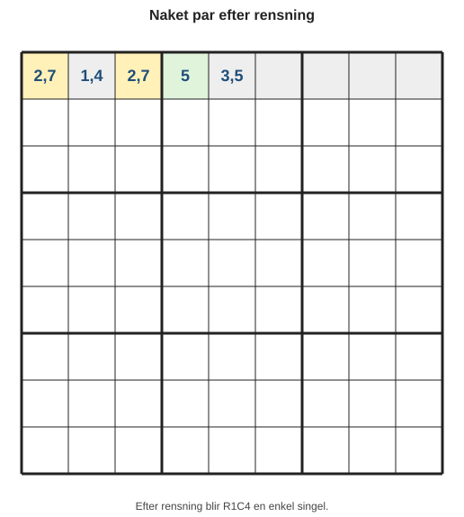
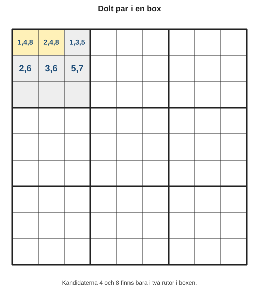
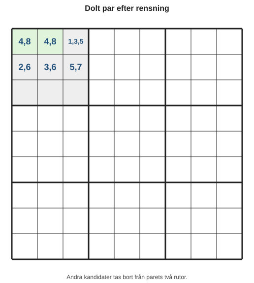
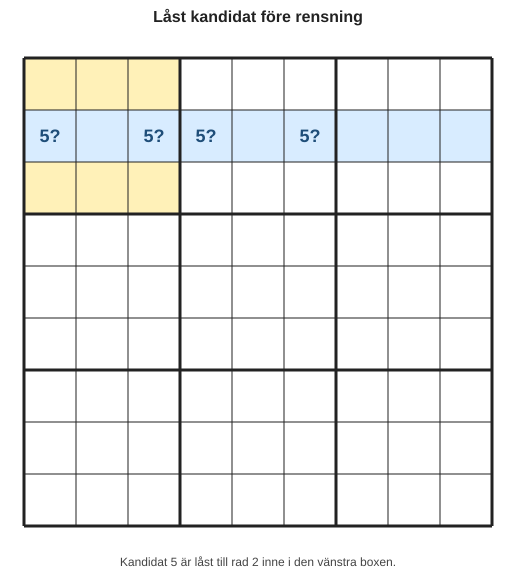
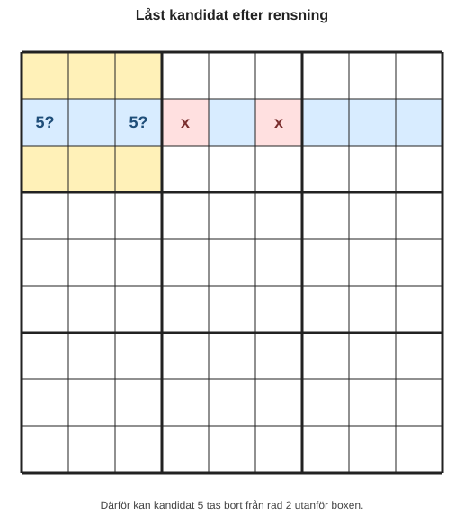
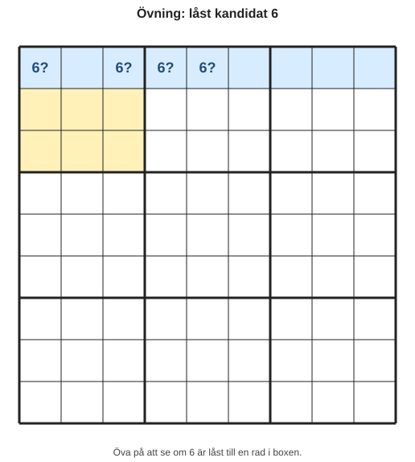

# Kapitel 6: Par och låsta möjligheter

## Varför detta kapitel finns

Hittills har du tränat på säkra placeringar, kandidater, scanning, singlar och ett systematiskt arbetssätt. I det här kapitlet tar vi nästa steg: du ska inte alltid försöka hitta en siffra att skriva in direkt. Ibland är det viktigaste steget att ta bort kandidater som inte längre kan stämma.

Det kan kännas ovant i början. Ett sudoku kan gå framåt även när ingen ny siffra placeras, eftersom en rensad kandidatlista ofta gör nästa säkra placering synlig.

## Lärandemål

Efter kapitlet ska du kunna:

- känna igen ett **naket par** i en rad, kolumn eller box,
- förstå hur ett **dolt par** skiljer sig från ett naket par,
- använda **låsta kandidater** för att ta bort kandidater utanför eller innanför en box,
- förklara varför en kandidat kan tas bort utan att gissa,
- använda par och låsta möjligheter som en del av din vanliga lösningsrutin.

## Innan vi börjar

Du behöver vara trygg med tre tidigare idéer:

- En **kandidat** är en möjlig siffra, inte ett svar.
- En **grupp** är en rad, kolumn eller box.
- En **kontrollpunkt** är en paus där du säkerställer att anteckningarna fortfarande följer reglerna.

I det här kapitlet arbetar vi nästan bara med kandidater. Det betyder att målet ofta är att göra anteckningarna tydligare, inte att fylla i en ruta omedelbart.

## Huvudförklaring

### Naket par

Ett naket par uppstår när två rutor i samma grupp har exakt samma två kandidater, och inga andra kandidater.

Exempel i en rad:

*Figur 6.1: R1C1 och R1C3 har exakt samma två kandidater: 2 och 7.*

Här har R1C1 och R1C3 exakt kandidaterna `2, 7`.

Det betyder:

- Den ena av de två rutorna måste vara 2.
- Den andra måste vara 7.
- Vi vet ännu inte vilken som är vilken.
- Men vi vet att siffrorna 2 och 7 är upptagna av dessa två rutor i raden.

Därför kan 2 och 7 tas bort från andra rutor i samma rad.

Efter rensning:

*Figur 6.2: När 2 och 7 rensas från R1C4 återstår bara 5.*

Nu har R1C4 blivit en enkel singel: den måste vara 5.

Det viktiga är inte att paret gav svaret direkt. Det viktiga är att paret gjorde en annan ruta tydligare.

### Så känner du igen ett naket par

Ställ tre frågor:

1. Finns det två rutor i samma rad, kolumn eller box?
2. Har båda exakt samma två kandidater?
3. Finns kandidaterna i andra rutor i samma grupp?

Om svaret är ja på alla tre kan du ta bort de två kandidaterna från de andra rutorna i gruppen.

### Dolt par

Ett dolt par är lite svårare att se. Då är två siffror låsta till två rutor i samma grupp, men rutorna kan ha fler kandidater antecknade.

Exempel i en box:

*Figur 6.3: I den övre vänstra boxen finns 4 och 8 bara i två rutor.*

Titta på siffrorna 4 och 8 i boxen.

De förekommer bara i två rutor:

- B1R1C1
- B1R1C2

Då måste 4 och 8 hamna i just dessa två rutor. Vi vet inte ordningen, men vi vet att de två rutorna är reserverade för 4 och 8.

Därför kan andra kandidater tas bort från de två rutorna.

Före rensningen har de två rutorna fler kandidater än paret. Efter rensningen ser samma situation ut så här:

*Figur 6.4: När andra kandidater tas bort blir det dolda paret synligt som ett naket par.*

Nu har det dolda paret blivit synligt som ett naket par.

### Skillnaden mellan naket och dolt par

| Teknik | Vad du letar efter | Vad du tar bort |
|---|---|---|
| Naket par | Två rutor med exakt samma två kandidater | Dessa två kandidater från andra rutor i gruppen |
| Dolt par | Två siffror som bara finns i samma två rutor | Andra kandidater från dessa två rutor |

Ett enkelt minne:

- Naket par: rutorna avslöjar paret.
- Dolt par: siffrorna avslöjar paret.

### Låsta kandidater

Låsta kandidater uppstår när en siffra i en box bara kan ligga i en enda rad eller kolumn inom boxen.

Tänk dig att kandidat 5 bara kan stå på två platser i en box, och att båda platserna ligger på samma rad:

*Figur 6.5: Kandidat 5 är låst till rad 2 inne i den vänstra boxen.*

Om box 1 redan har låst sin 5 till rad 2, måste 5 i box 1 ligga i någon av de två kandidatrutorna. Då kan 5 tas bort från andra rutor på rad 2 utanför box 1.

Efter rensning:

*Figur 6.6: Röda markeringar visar var kandidaten 5 har rensats bort.*

### Två riktningar för låsta kandidater

Låsta kandidater kan användas åt två håll.

| Typ | Vad du ser | Vad du gör |
|---|---|---|
| Box till rad/kolumn | En siffra i en box finns bara i en rad eller kolumn | Ta bort siffran från resten av raden eller kolumnen |
| Rad/kolumn till box | En siffra i en rad eller kolumn finns bara i en box | Ta bort siffran från resten av boxen |

Du behöver inte memorera namnen direkt. Det räcker att fråga:

**Är alla möjliga platser för den här siffran instängda i samma rad, kolumn eller box?**

Om svaret är ja finns ofta en kandidat att ta bort.

## Exempel

Vi arbetar med en rad där flera kandidater finns kvar.

| Ruta | C1 | C2 | C3 | C4 | C5 | C6 | C7 |
|---|---|---|---|---|---|---|---|
| Kandidater | 1, 9 | 3, 6 | 1, 9 | 4, 6, 9 | 2, 4 | 5 | 4, 8 |

Steg 1: Leta efter rutor med exakt två kandidater.

C1 har `1, 9`.
C3 har `1, 9`.

Steg 2: Kontrollera att de ligger i samma grupp.

Ja, båda ligger i samma rad.

Steg 3: Ta bort 1 och 9 från andra rutor i raden.

C4 har `4, 6, 9`, så 9 kan tas bort.

Efter rensning:

| Ruta | C1 | C2 | C3 | C4 | C5 | C6 | C7 |
|---|---|---|---|---|---|---|---|
| Kandidater | 1, 9 | 3, 6 | 1, 9 | 4, 6 | 2, 4 | 5 | 4, 8 |

Vi har ännu inte löst C1 eller C3. Men vi har gjort raden renare och minskat risken för misstag.

## Vanliga misstag

- **Misstag: Att behandla nästan-par som riktiga par.**
  - Varför det händer: Två rutor ser lika ut, men en av dem har en extra kandidat.
  - Hur man undviker det: Ett naket par måste ha exakt samma två kandidater i båda rutorna.

- **Misstag: Att ta bort kandidater från fel grupp.**
  - Varför det händer: Man ser ett par i en rad men rensar även i en box utan kontroll.
  - Hur man undviker det: Rensa bara i den grupp där paret faktiskt finns.

- **Misstag: Att tro att ett par direkt säger vilken siffra som ska stå var.**
  - Varför det händer: Paret känns som en lösning.
  - Hur man undviker det: Kom ihåg att paret reserverar två siffror för två rutor, men ordningen är fortfarande okänd.

- **Misstag: Att använda låsta kandidater utan att kontrollera alla möjliga platser.**
  - Varför det händer: Man ser två kandidater på samma rad och antar att de är låsta.
  - Hur man undviker det: Kontrollera hela boxen, raden eller kolumnen innan du rensar.

## Övningar

### Övning 1: Hitta det nakna paret

I raden nedan finns ett naket par. Vilka två rutor bildar paret, och vilka kandidater kan tas bort?

| Ruta | C1 | C2 | C3 | C4 | C5 | C6 |
|---|---|---|---|---|---|---|
| Kandidater | 2, 8 | 1, 5, 8 | 3, 6 | 2, 8 | 1, 5 | 4, 8 |

Svara i tre steg:

1. Paret är:
2. Kandidaterna som paret reserverar är:
3. Kandidater som kan tas bort:

### Övning 2: Dolt par

I boxen nedan förekommer siffrorna 3 och 7 bara i två rutor. Vilka kandidater kan tas bort från dessa rutor?

| Ruta | A | B | C |
|---|---|---|---|
| Kandidater | 1, 3, 7 | 2, 5 | 3, 7, 9 |

| Ruta | D | E | F |
|---|---|---|---|
| Kandidater | 1, 4 | 2, 6 | 5, 8 |

### Övning 3: Låsta kandidater

I en box kan siffran 6 bara stå i den översta raden.

*Figur 6.7: Kandidat 6 är låst till översta raden i boxen.*

Vilka kandidater för 6 kan tas bort?

### Fördjupning

Välj ett sudoku du redan har börjat lösa. Gör en lösningsrunda där du inte försöker skriva in nya siffror. Leta bara efter:

1. nakna par,
2. dolda par,
3. låsta kandidater.

Markera varje rensning du gör och skriv en kort motivering.

## Snabb sammanfattning

- Ett naket par är två rutor i samma grupp med exakt samma två kandidater.
- Ett naket par gör att dessa två kandidater kan tas bort från andra rutor i gruppen.
- Ett dolt par är två siffror som bara kan stå i samma två rutor.
- Ett dolt par gör att andra kandidater kan tas bort från de två rutorna.
- Låsta kandidater hjälper dig rensa kandidater mellan boxar, rader och kolumner.
- Dessa tekniker är logiska rensningar, inte gissningar.

## Quiz/reflektionsfrågor

1. Varför får du inte bestämma ordningen på siffrorna i ett naket par direkt?
2. Vad är skillnaden mellan att rensa andra rutor och att rensa samma två rutor?
3. Hur kan ett dolt par bli ett naket par efter rensning?
4. Vilken kontroll bör du göra innan du använder låsta kandidater?
5. Varför kan ett kapitel om att ta bort kandidater ändå hjälpa dig att fylla i fler siffror?

## Nästa steg

I nästa kapitel fortsätter vi med mönster i rader och kolumner. Du kommer att se hur låsningar kan sträcka sig över större delar av rutnätet och hur boxar samspelar med hela rader och kolumner.
