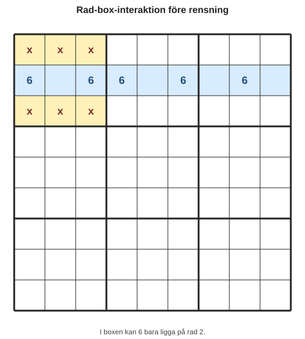
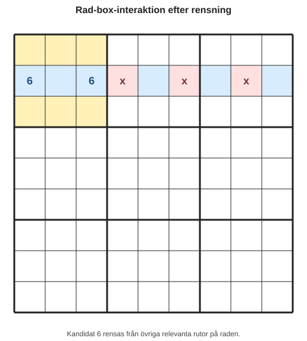
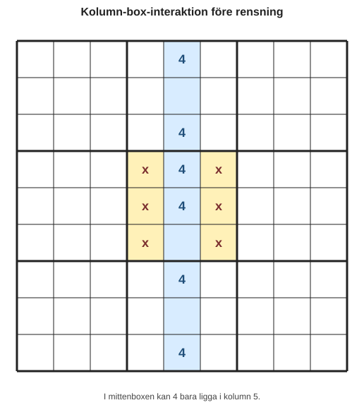
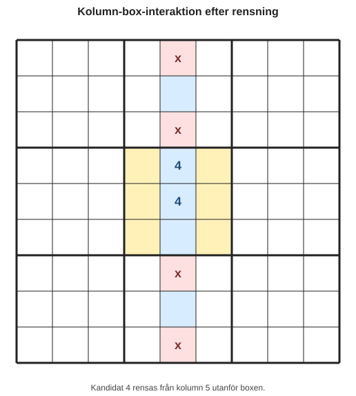
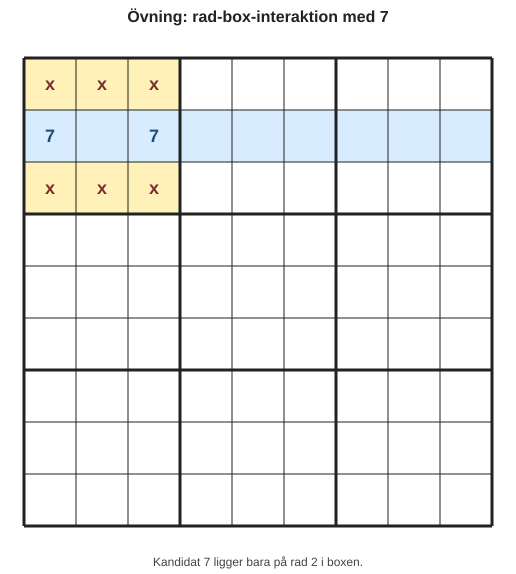
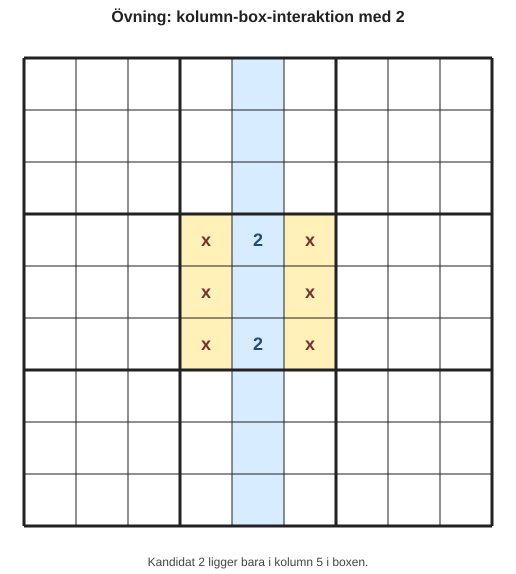

# Kapitel 7: Mönster i rader och kolumner

## Varför detta kapitel finns

I de tidigare kapitlen har du lärt dig att hitta säkra placeringar, skriva kandidater och rensa kandidater med par och låsta möjligheter. Nu går vi ett steg vidare: vi tittar på hur mönster kan uppstå mellan en box och en rad eller kolumn.

Det här kapitlet handlar inte om att gissa. Det handlar om att se när en siffra är **begränsad till ett visst område**, även om du ännu inte vet exakt vilken ruta siffran ska stå i.

## Lärandemål

Efter kapitlet ska du kunna:

- känna igen rad-box-interaktion,
- känna igen kolumn-box-interaktion,
- rensa kandidater när en siffra är låst till en del av en rad eller kolumn,
- förklara varför en kandidat kan tas bort utan att placera en siffra direkt.

## Innan vi börjar

Du behöver känna till:

- **kandidat**: en möjlig siffra i en tom ruta,
- **box**: ett 3×3-område,
- **rad** och **kolumn**,
- **låsta kandidater** från kapitel 6.

I kapitel 6 såg du att kandidater ibland kan bli låsta till en viss rad eller kolumn inne i en box. I det här kapitlet tränar vi särskilt på sådana mönster mellan rader, kolumner och boxar.

## Huvudförklaring

### Grundidén

Tänk dig att siffran 6 bara kan stå på två platser i en box. Om båda platserna ligger på samma rad, då vet vi något viktigt:

Siffran 6 måste hamna någonstans på den raden inne i boxen.

Det betyder att 6 inte kan stå på någon annan plats på samma rad utanför boxen.

Det här kallas här för **rad-box-interaktion**.

Samma sak kan hända med en kolumn. Om alla möjliga platser för en siffra i en box ligger i samma kolumn, kan den siffran tas bort från andra rutor i kolumnen utanför boxen. Det kallar vi **kolumn-box-interaktion**.

## Exempel 1: Rad-box-interaktion

Vi tittar på kandidater för siffran 6 i den övre vänstra boxen.

*Figur 7.1: I boxen kan kandidat 6 bara ligga på rad 2.*

I boxen kan 6 bara stå på rad 2. Vi vet inte om 6 ska stå i R2C1 eller R2C3, men vi vet att 6 måste vara någonstans på rad 2 inne i den här boxen.

Därför kan vi rensa 6 från andra rutor på rad 2 utanför boxen.

*Figur 7.2: Kandidat 6 rensas från relevanta rutor på samma rad utanför boxen.*

Vi har inte placerat en 6 ännu. Vi har bara minskat antalet möjliga platser.

## Exempel 2: Kolumn-box-interaktion

Nu tittar vi på kandidater för siffran 4 i en box.

*Figur 7.3: I mittenboxen kan kandidat 4 bara ligga i kolumn 5.*

Alla möjliga 4:or i den här boxen ligger i kolumn 5. Då måste 4:an i boxen hamna någonstans i kolumn 5.

Det betyder att 4 kan tas bort från andra rutor i kolumn 5 utanför boxen.

*Figur 7.4: Kandidat 4 rensas från kolumn 5 utanför boxen.*

Det viktiga är att du inte behöver veta exakt var 4 ska stå i boxen. Det räcker att veta att alla möjliga platser ligger i samma kolumn.

## Så känner du igen mönstret

Använd den här arbetsordningen:

1. Välj en siffra, till exempel 1.
2. Titta i en box.
3. Markera alla rutor där siffran fortfarande kan stå.
4. Fråga: ligger alla möjliga platser på samma rad?
5. Fråga: ligger alla möjliga platser i samma kolumn?
6. Om ja: rensa samma siffra från resten av raden eller kolumnen utanför boxen.
7. Kontrollera att du inte tog bort kandidaten inne i boxen.

Det här är ett rensningssteg, inte en placering.

## Skillnaden mellan placering och rensning

En vanlig nybörjarfälla är att tänka: “Siffran är låst till den här raden, alltså vet jag var den ska stå.”

Det stämmer inte alltid.

Om en 6:a kan stå i två rutor i samma box och samma rad vet vi bara att 6:an är någon av dessa två rutor. Vi vet ännu inte vilken.

Det vi får göra är att ta bort 6 från andra rutor på samma rad.

| Situation | Vad du vet | Vad du får göra |
|---|---|---|
| En kandidat finns i exakt en ruta | Siffran måste stå där | Placera siffran |
| En kandidat finns i flera rutor men samma rad i en box | Siffran måste stå i den raden inom boxen | Rensa samma kandidat från raden utanför boxen |
| En kandidat finns i flera rutor men samma kolumn i en box | Siffran måste stå i den kolumnen inom boxen | Rensa samma kandidat från kolumnen utanför boxen |

## Exempel 3: Från rensning till ny singel

Ibland leder rensningen direkt till en ny säker placering.

Anta att en ruta på rad 2 hade kandidaterna `3, 6`.

Efter rad-box-interaktionen tar du bort kandidaten 6 från rad 2 utanför boxen.

| Ruta | Kandidater före | Åtgärd | Kandidater efter |
|---|---|---|---|
| R2C5 | 3, 6 | Ta bort 6 | 3 |

Nu har R2C5 bara en kandidat kvar. Då har du fått en **enkel singel**, och 3 kan placeras där.

Mönstret placerade alltså inte siffran direkt, men det skapade ett nytt enkelt steg.

## Vanliga misstag

- **Misstag: Att rensa inne i boxen.**
  - Varför det händer: Man ser raden eller kolumnen men glömmer var låsningen finns.
  - Hur man undviker det: Rensa bara utanför den box där mönstret hittades.

- **Misstag: Att placera siffran för tidigt.**
  - Varför det händer: Två möjliga rutor kan kännas som “nästan löst”.
  - Hur man undviker det: Placera bara en siffra när det finns exakt en möjlig ruta.

- **Misstag: Att blanda ihop siffror.**
  - Varför det händer: Man scannar flera kandidater samtidigt.
  - Hur man undviker det: Arbeta med en siffra i taget.

- **Misstag: Att glömma kontrollpunkten.**
  - Varför det händer: Rensningar känns små och ofarliga.
  - Hur man undviker det: Kontrollera efter varje rensning om en ny enkel singel eller dold singel har uppstått.

## Övningar

### Övning 1: Hitta rad-box-interaktion

I boxen nedan tittar du bara på kandidaten 7.

*Figur 7.5: Kandidat 7 ligger bara på rad 2 i boxen.*

1. Är kandidaten 7 låst till en rad?
2. Vilken rad?
3. Var får du rensa kandidat 7?

### Övning 2: Hitta kolumn-box-interaktion

I boxen nedan tittar du bara på kandidaten 2.

*Figur 7.6: Kandidat 2 ligger bara i kolumn 5 i boxen.*

1. Är kandidaten 2 låst till en kolumn?
2. Vilken kolumn?
3. Var får du rensa kandidat 2?

### Övning 3: Avgör om du får rensa

För varje exempel: svara ja eller nej.

| Exempel | Möjliga platser för siffran i boxen | Får du rensa från rad/kolumn utanför boxen? |
|---|---|---|
| A | R1C1 och R1C3 | |
| B | R1C1 och R2C1 | |
| C | R1C1 och R2C2 | |
| D | R3C2, R3C3 och R3C1 | |

### Övning 4: Rensning som skapar en singel

En ruta har kandidaterna `5, 8`. Efter en rad-box-interaktion får du ta bort 8 från rutan.

1. Vilken kandidat finns kvar?
2. Är detta en säker placering?
3. Vilken tidigare strategi använder du nu?

### Fördjupning

Skapa ett eget litet exempel där en kandidat är låst till en rad i en box. Visa:

1. boxen där låsningen finns,
2. raden utanför boxen,
3. vilka kandidater som tas bort.

## Snabb sammanfattning

- Rad-box-interaktion uppstår när alla möjliga platser för en siffra i en box ligger på samma rad.
- Kolumn-box-interaktion uppstår när alla möjliga platser för en siffra i en box ligger i samma kolumn.
- Du får rensa samma kandidat från raden eller kolumnen utanför boxen.
- Du får inte automatiskt placera siffran.
- Rensningen kan skapa nya enkla singlar eller dolda singlar.

## Quiz/reflektionsfrågor

1. Varför räcker det inte alltid att en kandidat är låst till två rutor?
2. Vad är skillnaden mellan att placera en siffra och att rensa en kandidat?
3. Varför ska du bara rensa utanför den box där mönstret hittades?
4. Hur kan en rad-box-interaktion skapa en enkel singel?
5. Vilken kontrollpunkt bör du göra efter en kandidatrensning?

## Nästa steg

I nästa kapitel går vi vidare till vad du kan göra när du kör fast. Då använder vi strategierna du redan kan, men fokuserar på felsökning, återstart och hur du hittar tillbaka till ett metodiskt arbetssätt utan att börja gissa.
