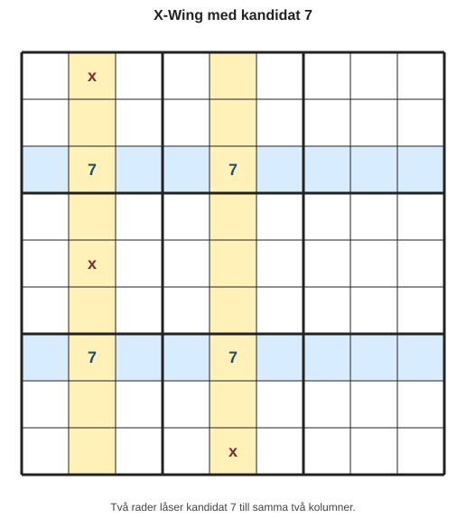
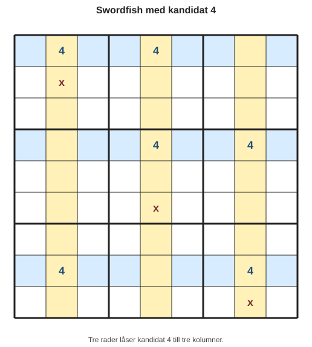
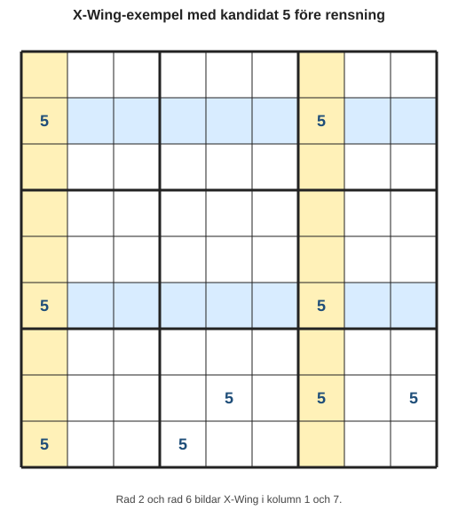
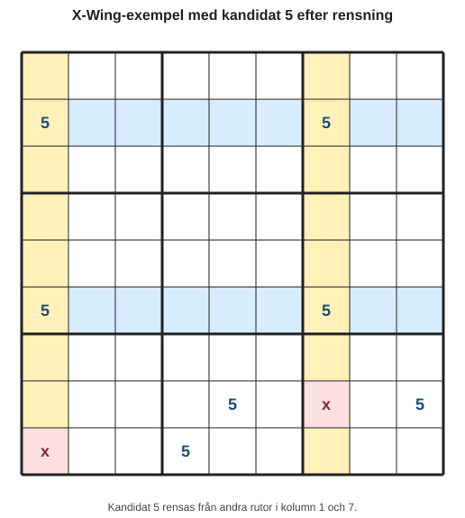
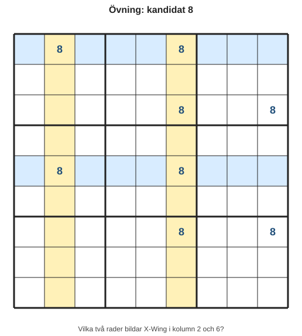
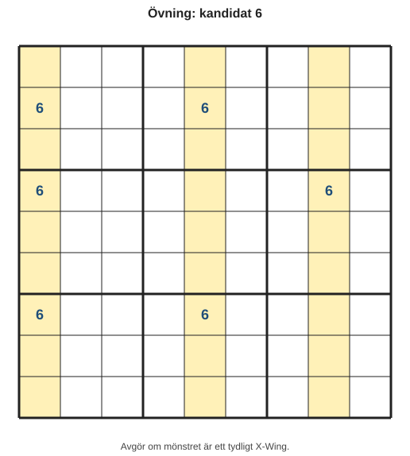
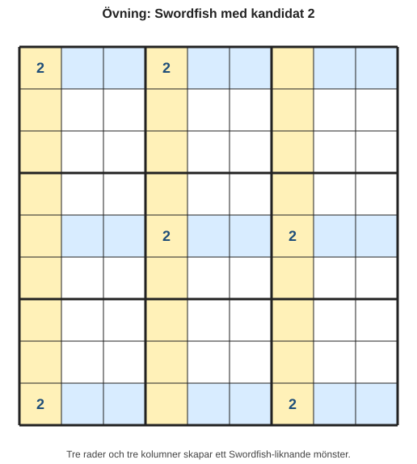

# Kapitel 10: Avancerade strategier på ett lugnt sätt

## Varför detta kapitel finns

Nu har du lärt dig de viktigaste grunderna: regler, kandidater, singlar, par, låsta kandidater och felsökning. Det räcker långt. Många sudoku kan lösas med just de verktygen, särskilt om du arbetar systematiskt.

Ibland möter du ändå ett rutnät där inget vanligt steg verkar fungera. Då kan det vara dags att leta efter större mönster. Det är här avancerade strategier kommer in.

Det här kapitlet är inte tänkt att göra dig till expert direkt. Målet är att du ska förstå principen bakom några vanliga avancerade tekniker och kunna känna igen när ett mönster kanske finns. Vi tar det långsamt och använder samma grundregel som tidigare:

> En avancerad strategi är fortfarande bara ett sätt att utesluta omöjliga kandidater.

## Lärandemål

Efter kapitlet ska du kunna:

- förstå vad ett avancerat kandidatmönster är,
- känna igen grundidén i X-Wing,
- förstå Swordfish som en större version av samma tänkande,
- förstå vad en kedja är på en enkel nivå,
- avgöra när det är rimligt att leta efter avancerade strategier,
- fortsätta skilja mellan kandidatrensning och säker placering.

## Innan vi börjar

Du behöver känna till:

- **kandidat**,
- **kandidatlista**,
- **eliminering**,
- **låsta kandidater**,
- **rad-box-interaktion** och **kolumn-box-interaktion**,
- **logisk motivering**.

Det viktigaste att ta med sig är detta:

> Avancerade strategier handlar oftast inte om att fylla i en siffra direkt. De handlar om att ta bort kandidater så att enklare strategier blir möjliga igen.

## Huvudförklaring

### Vad menas med ett avancerat mönster?

Ett avancerat mönster är en situation där flera kandidater tillsammans visar att vissa andra kandidater inte kan stämma.

Tidigare har du ofta tittat på en ruta, en rad, en kolumn eller en box. Nu tittar du ibland på flera rader och kolumner samtidigt.

| Tidigare strategi | Vanlig fråga |
|---|---|
| Enkel singel | Har rutan bara en kandidat kvar? |
| Dold singel | Kan siffran bara stå på en plats i gruppen? |
| Naket par | Delar två rutor exakt samma två kandidater? |
| Låsta kandidater | Är kandidaten låst till en rad, kolumn eller box? |
| Avancerat mönster | Tvingar flera kandidater varandra på ett sätt som rensar andra kandidater? |

Det kan låta abstrakt, men grundidén är enkel: kandidater bildar mönster. När mönstret är tillräckligt tydligt kan du rensa bort kandidater som inte längre kan vara sanna.

### X-Wing: två rader och två kolumner

X-Wing är en strategi som bygger på en viss siffra. Du väljer en kandidat, till exempel 7, och undersöker var den kan stå i olika rader eller kolumner.

Ett enkelt X-Wing i rader fungerar så här:

- I rad A kan siffran 7 bara stå i två kolumner.
- I rad B kan siffran 7 också bara stå i samma två kolumner.
- Då måste 7:orna i de två raderna hamna i dessa två kolumner.
- Därför kan 7 tas bort från andra rutor i samma två kolumner.

Tänk dig detta förenklade mönster:

*Figur 10.1: Rad 3 och rad 7 låser kandidat 7 till kolumn 2 och kolumn 5.*

Det betyder inte att du vet vilken av rutorna i rad 3 som är 7. Det betyder inte heller att du vet vilken av rutorna i rad 7 som är 7.

Men du vet detta:

- Om rad 3 får 7 i kolumn 2, måste rad 7 få 7 i kolumn 5.
- Om rad 3 får 7 i kolumn 5, måste rad 7 få 7 i kolumn 2.

I båda fallen används kolumn 2 och kolumn 5 av dessa två rader. Därför kan andra 7-kandidater i kolumn 2 och kolumn 5 tas bort.

| Plats | Kandidat 7? | Efter X-Wing |
|---|---|---|
| Rad 3, kolumn 2 | Ja | Behåll |
| Rad 3, kolumn 5 | Ja | Behåll |
| Rad 7, kolumn 2 | Ja | Behåll |
| Rad 7, kolumn 5 | Ja | Behåll |
| Annan ruta i kolumn 2 | Ja | Ta bort 7 |
| Annan ruta i kolumn 5 | Ja | Ta bort 7 |

Det viktiga är att X-Wing ger kandidatrensning, inte en direkt placering.

### Kontrollfrågor för X-Wing

Innan du använder X-Wing bör du kunna svara ja på tre frågor:

1. Tittar jag på en enda siffra?
2. Finns siffran som kandidat exakt två gånger i två olika rader?
3. Ligger kandidaterna i samma två kolumner?

Om svaret är ja kan du ha ett X-Wing-mönster i rader.

Det finns också en spegelvänd variant:

1. Tittar jag på en enda siffra?
2. Finns siffran som kandidat exakt två gånger i två olika kolumner?
3. Ligger kandidaterna i samma två rader?

Då kan du ha ett X-Wing-mönster i kolumner.

### Swordfish: samma idé, men större

Swordfish kan kännas som ett stort ord, men principen är nära X-Wing.

I X-Wing arbetar du med:

- två rader,
- två kolumner,
- en kandidat.

I Swordfish arbetar du med:

- tre rader,
- tre kolumner,
- en kandidat.

Ett förenklat Swordfish-mönster kan se ut så här:

*Figur 10.2: Tre rader låser tillsammans kandidat 4 till tre kolumner.*

De tre raderna låser tillsammans kandidat 4 till tre kolumner. Därför kan andra 4-kandidater i dessa tre kolumner tas bort.

Du behöver inte behärska Swordfish fullt ut ännu. Det viktiga i det här skedet är att förstå att det är en större version av samma tanke:

> Ett begränsat mönster i vissa rader och kolumner kan göra andra kandidater omöjliga.

### Kedjor: om detta är sant, då händer detta

En kedja är ett resonemang där du följer konsekvenser mellan kandidater.

En enkel kedjetanke kan låta så här:

- Om ruta A är 6, då kan ruta B inte vara 6.
- Om ruta B inte är 6, då måste ruta C vara 6.
- Om ruta C är 6, då påverkas ruta D.

Kedjor kan bli mycket avancerade. I den här boken använder vi bara grundidén: en kedja är ett sätt att följa logiska beroenden, inte ett sätt att gissa.

| Gissning | Kedjeresonemang |
|---|---|
| Jag provar 6 här och ser vad som händer. | Om 6 står här följer detta logiskt. |
| Jag hoppas att det fungerar. | Varje steg måste kunna motiveras. |
| Jag suddar om det blir fel. | Jag rensar bara om slutsatsen är säker. |

Skillnaden är viktig. En kedja ska inte vara en hemlig form av gissning. Den ska vara ett tydligt resonemang där varje steg bygger på en regel.

### När ska du leta efter avancerade strategier?

Det är lätt att börja leta efter X-Wing för tidigt. Gör inte det. Avancerade strategier är mest användbara när de enklare stegen är kontrollerade.

Använd denna ordning:

1. Kontrollera enkla singlar.
2. Kontrollera dolda singlar.
3. Uppdatera kandidater.
4. Leta efter nakna och dolda par.
5. Leta efter låsta kandidater.
6. Gör en kontrollpunkt.
7. Leta först därefter efter X-Wing eller liknande mönster.

| Situation | Rekommenderat steg |
|---|---|
| Många rutor saknar kandidater | Uppdatera anteckningarna först. |
| Det finns rutor med en kandidat | Lös enkla singlar först. |
| En siffra saknas på få platser i en box | Leta efter dold singel eller låsta kandidater. |
| Inga enklare steg syns | Leta efter X-Wing eller större mönster. |
| Du kan inte förklara mönstret | Avstå från rensning och kontrollera igen. |

## Exempel

Vi använder ett förenklat exempel med kandidat 5.

*Figur 10.3: Rad 2 och rad 6 bildar ett X-Wing i kolumn 1 och kolumn 7.*

Titta bara på rad 2 och rad 6.

I båda dessa rader kan kandidat 5 bara stå i kolumn 1 eller kolumn 7. Det skapar ett X-Wing-mönster.

Det betyder att 5 i kolumn 1 och kolumn 7 måste användas av rad 2 och rad 6. Därför kan 5 tas bort från andra rutor i kolumn 1 och kolumn 7.

Efter rensningen:

*Figur 10.4: Kandidat 5 rensas från andra rutor i kolumn 1 och kolumn 7.*

Observera att vi inte fyllde i någon 5:a direkt. Vi rensade bara bort kandidater. Efter det kan en enklare strategi kanske bli synlig.

## Vanliga misstag

### Misstag: Att tro att X-Wing placerar siffror direkt

- Varför det händer: Mönstret ser starkt ut, så det känns som om svaret borde vara klart.
- Hur du undviker det: Kom ihåg att X-Wing normalt rensar kandidater i andra rutor. Det säger inte vilken av mönsterrutorna som är den rätta ännu.

### Misstag: Att blanda flera siffror i samma mönster

- Varför det händer: Rutnätet innehåller många kandidater samtidigt.
- Hur du undviker det: Välj en siffra i taget. Ett X-Wing-mönster gäller alltid en bestämd kandidat.

### Misstag: Att se ett mönster där det finns för många kandidater

- Varför det händer: Man ser två rader och två kolumner men missar en extra kandidat.
- Hur du undviker det: Kontrollera att kandidaten förekommer exakt på de platser som strategin kräver.

### Misstag: Att använda kedjor som gissning

- Varför det händer: Kedjor kan likna “prova och se”.
- Hur du undviker det: Skriv bara ner slutsatser där varje steg kan förklaras logiskt.

## Övningar

### Övning 1: Känn igen ett X-Wing

Bilden visar kandidat 8 i fyra rader.

*Figur 10.5: Vilka två rader bildar X-Wing i kolumn 2 och kolumn 6?*

Fråga: Vilka två rader bildar ett X-Wing i kolumn 2 och kolumn 6?

### Övning 2: Vad får rensas?

I detta förenklade exempel bildar rad 2 och rad 8 ett X-Wing för kandidat 3 i kolumn 4 och kolumn 9.

| Plats | Kandidat 3? |
|---|---|
| Rad 2, kolumn 4 | Ja |
| Rad 2, kolumn 9 | Ja |
| Rad 8, kolumn 4 | Ja |
| Rad 8, kolumn 9 | Ja |
| Rad 5, kolumn 4 | Ja |
| Rad 6, kolumn 9 | Ja |
| Rad 5, kolumn 2 | Ja |

Fråga: Från vilka platser kan kandidat 3 tas bort?

### Övning 3: X-Wing eller inte?

Undersök kandidat 6.

*Figur 10.6: Avgör om mönstret är ett tydligt X-Wing.*

Fråga: Finns ett tydligt X-Wing här? Motivera ditt svar.

### Övning 4: Swordfish på igenkänningsnivå

Titta på kandidat 2.

*Figur 10.7: Tre rader och tre kolumner skapar ett Swordfish-liknande mönster.*

Fråga: Varför liknar detta ett Swordfish-mönster?

### Övning 5: Gissning eller kedja?

Läs formuleringarna och avgör om de låter som gissning eller logisk kedja.

| Formulering | Gissning eller kedja? |
|---|---|
| “Jag testar 4 här och ser om det går.” |  |
| “Om den här rutan är 4, kan nästa ruta inte vara 4 eftersom de ligger i samma rad.” |  |
| “Det känns som att 9 borde stå här.” |  |
| “Eftersom dessa två kandidater låser varandra kan den tredje rutan inte ha samma kandidat.” |  |

## Snabb sammanfattning

- Avancerade strategier bygger fortfarande på logik och eliminering.
- X-Wing använder två rader och två kolumner för en kandidat.
- Swordfish är en större variant med tre rader och tre kolumner.
- Kedjor följer logiska konsekvenser steg för steg.
- Avancerade tekniker ska användas efter att enklare metoder har kontrollerats.
- En avancerad strategi ger ofta kandidatrensning, inte direkt placering.

## Quiz/reflektionsfrågor

1. Varför ska du bara titta på en kandidat i taget när du letar efter X-Wing?
2. Vad är skillnaden mellan att rensa en kandidat och att placera en siffra?
3. Varför bör du kontrollera enkla singlar innan du letar efter avancerade mönster?
4. På vilket sätt är Swordfish släkt med X-Wing?
5. Hur kan en kedja vara logisk utan att bli gissning?

## Nästa steg

I nästa kapitel ska vi sätta ihop flera strategier i längre lösningsflöden. Då blir fokus inte att lära sig en ny teknik, utan att välja rätt teknik vid rätt tillfälle och förstå hur ett helt sudoku kan lösas från början till slut.
