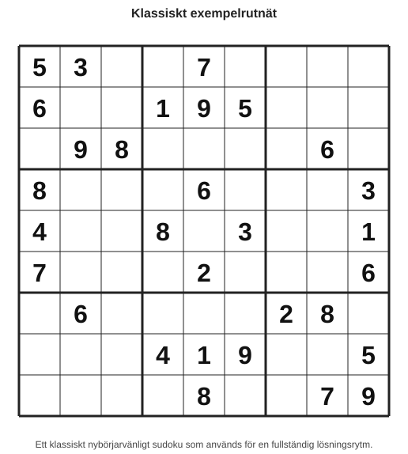
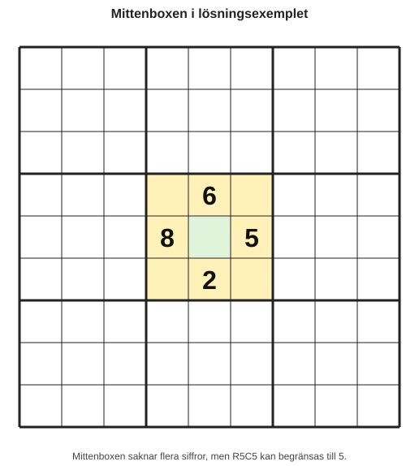
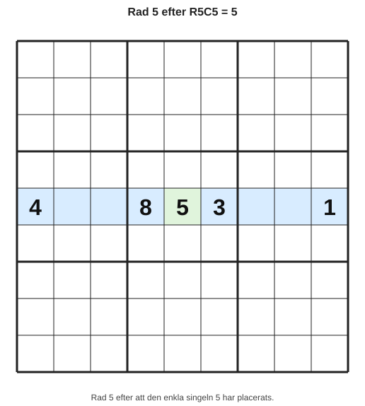
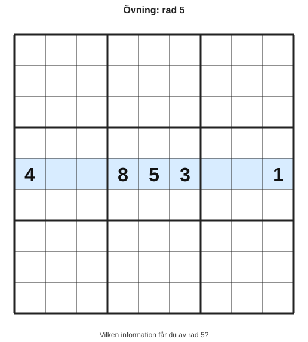

# Kapitel 11: Fullständiga lösningar steg för steg

## Varför detta kapitel finns

Hittills har du lärt dig många separata verktyg: regler, kandidater, scanning, singlar, par, låsta kandidater, mönster och felsökning. Det är värdefullt, men i ett riktigt sudoku kommer teknikerna sällan i en prydlig ordning.

Ett komplett sudoku kräver att du växlar mellan strategier. Ibland hittar du en säker placering. Ibland behöver du uppdatera kandidater. Ibland behöver du stanna upp och fråga: “Vilken strategi passar just nu?”

Det här kapitlet visar hur du kan tänka genom ett helt lösningsflöde utan att gissa.

## Lärandemål

Efter kapitlet ska du kunna:

- följa ett lösningsflöde från start till slut,
- välja enkel strategi innan du provar svårare strategier,
- dokumentera varför en placering är säker,
- uppdatera kandidater efter varje viktig placering,
- använda kontrollpunkter för att undvika fel,
- förstå hur flera små logiska steg tillsammans löser ett sudoku.

## Innan vi börjar

Du behöver känna till:

- **rad**, **kolumn** och **box**,
- **kandidat** och **kandidatlista**,
- **säker placering**,
- **eliminering**,
- **enkel singel** och **dold singel**,
- **naket par** och **låsta kandidater**,
- **kontrollpunkt**.

I det här kapitlet introducerar vi två nya huvudbegrepp:

- **lösningsflöde**: den ordning du använder för att lösa rutnätet steg för steg,
- **strategiurval**: beslutet om vilken strategi som är mest rimlig att prova härnäst.

## Huvudförklaring

### Ett lösningsflöde är inte en rak linje

När man är nybörjare är det lätt att tänka att ett sudoku ska lösas så här:

1. hitta alla enkla rutor,
2. gå vidare till medelsvåra tekniker,
3. avsluta med avancerade strategier.

I praktiken går det oftast fram och tillbaka.

Du kan till exempel göra så här:

1. hitta en dold singel,
2. fylla i siffran,
3. uppdatera kandidater,
4. hitta ett naket par,
5. ta bort kandidater,
6. upptäcka en ny enkel singel,
7. fortsätta med scanning.

Det betyder inte att du gör fel. Det betyder att rutnätet svarar på dina steg.

### Den rekommenderade arbetsordningen

När du ska lösa ett helt sudoku kan du använda denna ordning:

| Steg | Fråga | Syfte |
|---|---|---|
| 1 | Finns uppenbara säkra placeringar? | Komma igång utan onödigt arbete. |
| 2 | Finns enkla singlar? | Hitta rutor med bara en kandidat. |
| 3 | Finns dolda singlar? | Hitta siffror som bara har en möjlig plats i en grupp. |
| 4 | Behöver kandidater uppdateras? | Undvika att gamla anteckningar leder fel. |
| 5 | Finns par eller låsta kandidater? | Rensa kandidater och skapa nya möjligheter. |
| 6 | Behövs ett större mönster? | Används först när enklare steg inte räcker. |
| 7 | Behövs felsökning? | Kontrollera att inget tidigare steg blev fel. |

Den viktigaste principen är:

> Använd den enklaste strategi som kan ge ett säkert steg.

### Exempelrutnät

Vi använder ett kompakt exempel.

*Figur 11.1: Ett klassiskt nybörjarvänligt sudoku som används för att träna lösningsrytm.*

Det här är ett klassiskt nybörjarvänligt sudoku. Vi ska inte lösa varje ruta i detalj, men vi ska följa tillräckligt många steg för att se arbetsflödet.

## Exempel: Från första steg till lösningsrytm

### Steg 1: Leta efter uppenbara säkra placeringar

Börja med scanning. Titta på siffran 5.

I övre vänstra boxen finns redan 5 i R1C1. I mittenboxen högst upp finns 5 i R2C6. I högra övre boxen saknas 5, men flera rutor blockeras av befintliga 5:or i rader och kolumner.

I början behöver du inte hitta allt direkt. Målet är att hitta något säkert.

Ett annat effektivt val är att titta på boxen i mitten, alltså raderna 4–6 och kolumnerna 4–6:

*Figur 11.2: Mittenboxen är en bra plats att börja eftersom flera siffror redan är givna.*

Boxen saknar siffrorna 1, 4, 5, 7 och 9. Om vi undersöker kandidaterna kan några rutor begränsas snabbt.

### Steg 2: Skriv kandidater där de gör nytta

Du behöver inte fylla hela rutnätet med kandidater från början. Välj en box, rad eller kolumn där många siffror redan finns.

Titta på ruta R5C5. Rad 5 innehåller 4, 8, 3 och 1. Kolumn 5 innehåller 7, 9, 6, 2, 1 och 8. Boxen innehåller 6, 8, 3 och 2.

Då återstår bara 5 i R5C5.

| Ruta | Kandidater | Slutsats |
|---|---|---|
| R5C5 | 5 | R5C5 = 5 |

Detta är en enkel singel. Vi kan fylla i 5.

### Steg 3: Uppdatera efter varje viktig placering

När R5C5 blir 5 påverkar det:

- rad 5,
- kolumn 5,
- mittenboxen.

Det betyder att 5 inte längre får vara kandidat i andra tomma rutor i dessa grupper.

Det här är ett vanligt nybörjarmisstag: man hittar en korrekt siffra men glömmer att uppdatera kandidaterna. Då ser rutnätet svårare ut än det är.

### Steg 4: Leta efter nya singlar

Efter att du fyllt i en siffra kan nya enkla singlar uppstå.

Titta på rad 5:

*Figur 11.3: Rad 5 efter att den säkra placeringen R5C5 = 5 har gjorts.*

Rad 5 saknar 2, 6, 7 och 9. Om du jämför med kolumnerna kan vissa rutor begränsas.

Det viktiga är inte att memorera svaret. Det viktiga är arbetsmönstret:

1. välj en rad, kolumn eller box med många ifyllda siffror,
2. skriv saknade siffror,
3. jämför med korsande grupper,
4. fyll bara i det som är säkert.

### Steg 5: När singlarna tar slut, byt strategi

Förr eller senare kommer du till en punkt där du inte direkt ser fler singlar. Då ska du inte gissa.

Gå i stället vidare till nästa nivå:

| Om du inte hittar | Prova |
|---|---|
| Enkel singel | Dold singel |
| Dold singel | Naket par |
| Naket par | Låsta kandidater |
| Låsta kandidater | Större mönster eller felsökning |

Detta är strategiurval. Du väljer inte en teknik för att den verkar imponerande, utan för att den passar situationen.

### Steg 6: Använd en kontrollpunkt

Efter några placeringar bör du pausa.

En enkel kontrollpunkt kan vara:

- Har varje rad fortfarande högst en av varje siffra?
- Har varje kolumn fortfarande högst en av varje siffra?
- Har varje box fortfarande högst en av varje siffra?
- Har jag tagit bort kandidater av en tydlig anledning?
- Har jag markerat någon gissning som om den vore säker?

Om svaret på sista frågan är ja, behöver du backa.

## En enkel lösningslogg

Ett bra sätt att träna är att skriva en kort lösningslogg. Den behöver inte vara lång.

| Steg | Åtgärd | Motivering |
|---|---|---|
| 1 | R5C5 = 5 | Enkel singel efter kontroll av rad, kolumn och box. |
| 2 | Uppdatera kandidater i rad 5, kolumn 5 och mittenboxen | 5 är inte längre möjlig där. |
| 3 | Kontrollera rader med många givna siffror | Störst chans att hitta nya singlar. |
| 4 | Leta efter dolda singlar i boxar | Nästa enklaste strategi. |
| 5 | Pausa och kontrollera | Säkerställa att inga gamla kandidater ligger kvar. |

Lösningsloggen hjälper dig att se att sudoku inte är magi. Det är en serie små, motiverade beslut.

## Vanliga misstag

- **Misstag: Att byta till avancerade strategier för tidigt.**  
  Varför det händer: Man känner sig fast och vill hitta något kraftfullt.  
  Hur man undviker det: Kontrollera först singlar, dolda singlar, par och låsta kandidater.

- **Misstag: Att inte uppdatera kandidater.**  
  Varför det händer: Man fokuserar på nästa siffra direkt.  
  Hur man undviker det: Gör kandidatstädning till en fast del av varje placering.

- **Misstag: Att lösa utan motivering.**  
  Varför det händer: En siffra “känns rätt”.  
  Hur man undviker det: Skriv en kort orsak innan du fyller i rutan.

- **Misstag: Att tro att varje stopp betyder att rutnätet är för svårt.**  
  Varför det händer: Man förväntar sig jämnt flöde.  
  Hur man undviker det: Använd stopp som signal för felsökning eller strategiurval.

## Övningar

### Övning 1: Välj nästa strategi

Du har kontrollerat ett rutnät och hittar inga enkla singlar.

Vad bör du prova först?

1. Gissa i en ruta med två kandidater.
2. Leta efter dolda singlar i rader, kolumner och boxar.
3. Hoppa direkt till Swordfish.
4. Börja om hela sudokut.

### Övning 2: Skriv en lösningslogg

Använd denna rad:

*Figur 11.4: Utgå från raden och skriv en lösningslogg.*

Radens saknade siffror är 2, 6, 7 och 9.

Skriv en kort lösningslogg för hur du skulle undersöka raden. Du behöver inte lösa hela raden. Fokusera på arbetsordningen.

### Övning 3: Hitta den svaga länken

En lösare skriver:

> “Jag satte 7 i R3C4 eftersom det såg ut att passa där.”

Vad saknas i resonemanget?

### Övning 4: Bygg en kontrollpunkt

Skriv en egen kontrollpunkt med fyra frågor du vill ställa efter var femte placering.

### Fördjupning

Ta ett enkelt sudoku från en tidning eller app. Lös de första tio säkra stegen och skriv en lösningslogg med tre kolumner:

| Steg | Placering eller kandidatrensning | Motivering |
|---|---|---|
| 1 | | |
| 2 | | |
| 3 | | |

Målet är inte snabbhet. Målet är att varje steg ska kunna förklaras.

## Snabb sammanfattning

- Ett lösningsflöde är den ordning du använder för att lösa rutnätet steg för steg.
- Strategiurval betyder att du väljer den enklaste rimliga strategin för situationen.
- Efter varje viktig placering behöver kandidater uppdateras.
- Fullständiga lösningar består ofta av många små steg, inte ett stort genidrag.
- En kort lösningslogg gör ditt tänkande tydligare och minskar risken för gissningar.

## Quiz/reflektionsfrågor

1. Varför bör du prova enkla strategier innan avancerade strategier?
2. Vad är skillnaden mellan lösningsflöde och en enskild strategi?
3. Varför är kandidatstädning viktig efter en placering?
4. Vad bör du göra om du inte hittar fler säkra placeringar?
5. Hur kan en lösningslogg hjälpa dig att upptäcka fel?

## Nästa steg

Nu har du sett hur teknikerna kan användas tillsammans i ett helt lösningsflöde. I nästa kapitel får du träna mer själv. Där ligger fokus på korta uppgifter på flera nivåer, så att du kan befästa både grunderna och de mer avancerade strategierna.
