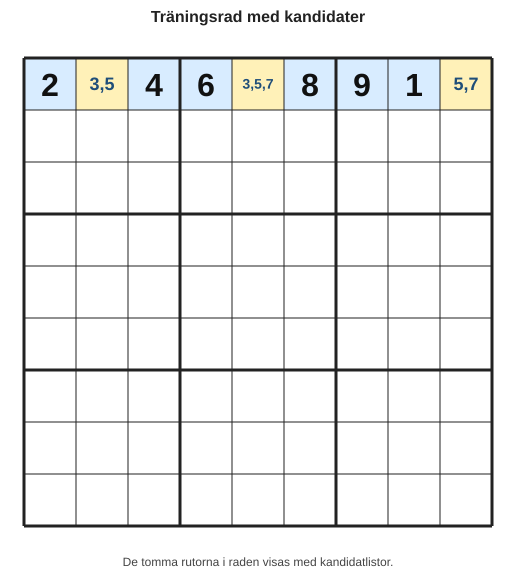

# Kapitel 12: Träningskapitel

## Varför detta kapitel finns

Nu har du mött bokens viktigaste metoder: regler, kandidater, singlar, par, låsta kandidater, felsökning och ett första möte med avancerade mönster. Det här kapitlet är annorlunda. Här är målet inte att introducera många nya begrepp, utan att träna.

Träning i sudoku fungerar bäst när den är lagom styrd. Om uppgifterna är för lätta blir de mekaniska. Om de är för svåra börjar man lätt gissa. Därför får du i det här kapitlet flera korta övningar per steg, med ledtrådar och facit.

Tanken är att du ska kunna använda kapitlet på två sätt:

1. som repetition efter att du läst hela boken,
2. som träningsbank när du vill öva en viss strategi.

## Lärandemål

Efter kapitlet ska du kunna:

- välja en lämplig strategi utifrån vad rutnätet visar,
- skilja mellan en placering och en kandidatrensning,
- använda ledtrådar utan att direkt gå till facit,
- lösa korta delproblem med logisk motivering,
- träna på flera svårighetsnivåer utan att gissa,
- formulera nästa steg i ett sudoku med egna ord.

## Innan vi börjar

Du behöver känna till:

- **rad**, **kolumn**, **box** och **ruta**,
- **kandidat** och **kandidatlista**,
- **enkel singel** och **dold singel**,
- **naket par**, **dolt par** och **låsta kandidater**,
- **kontrollpunkt**,
- **logisk motivering**.

I det här kapitlet introducerar vi två nya träningsbegrepp:

- **ledtrådsnivå**: hur mycket hjälp en uppgift ger innan facit,
- **övningslogg**: en kort anteckning där du skriver vilken strategi du använde och varför.

## Huvudförklaring

### Träna i små block

Ett vanligt misstag är att bara lösa hela sudoku efter hela sudoku. Det kan vara roligt, men det är inte alltid bästa sättet att bli bättre. Om du vill utveckla en viss strategi behöver du ibland isolera den.

I det här kapitlet tränar vi därför på tre nivåer:

| Nivå | Vad du tränar | Typ av uppgift |
|---|---|---|
| A | Hitta ett säkert nästa steg | Kort delproblem |
| B | Välja strategi | Rutnät eller kandidatutdrag |
| C | Kombinera flera steg | Längre lösningssekvens |

Du behöver inte göra alla uppgifter i ordning. Men om du är osäker är den bästa ordningen A, sedan B, sedan C.

### Använd ledtrådar i rätt ordning

Varje större övning har ibland tre ledtrådsnivåer:

| Ledtrådsnivå | När du ska använda den | Vad den hjälper med |
|---|---|---|
| 1 | När du inte vet var du ska börja | Pekar på rätt område |
| 2 | När du vet området men inte strategin | Pekar på strategi |
| 3 | När du nästan ser lösningen | Pekar på exakt kontrollfråga |

Försök att inte läsa alla ledtrådar på en gång. Läs en, prova själv, och gå vidare bara om du fortfarande sitter fast.

### Skriv en övningslogg

Efter varje uppgift kan du skriva en enkel rad:

| Uppgift | Strategi | Min motivering | Säker? |
|---|---|---|---|
| 1 | Dold singel | Siffran 7 kan bara stå i en ruta i boxen. | Ja |

Övningsloggen är inte till för att göra arbetet långsamt. Den är till för att träna dig i att skilja logik från känsla.

## Exempel: Så arbetar du med en träningsuppgift

Titta på detta lilla utdrag från en rad.

*Figur 12.1: Raden visar givna siffror och kandidatlistor för de tomma rutorna.*

Fråga: Finns det en säker placering?

Siffrorna som saknas i raden är 3, 5 och 7. Siffran 3 finns bara som kandidat i R1C2 och R1C5, så den är inte säker. Siffran 5 finns i alla tre tomma rutor, så den är inte säker. Siffran 7 finns i R1C5 och R1C9, så den är inte säker.

Alltså finns ingen säker placering i raden ännu.

Detta är också ett träningsresultat. Alla övningar leder inte direkt till en ifylld siffra. Ibland är rätt slutsats: “Här behöver jag titta på en annan grupp.”

## Övningsblock A: Enkla singlar

### Övning A1

En ruta har följande kandidater:

| Ruta | Kandidater |
|---|---|
| R4C7 | 6 |

Vad ska du göra?

**Skriv din motivering innan du tittar på facit.**

### Övning A2

Tre rutor i samma box har dessa kandidater:

| Ruta | Kandidater |
|---|---|
| R1C1 | 2, 8 |
| R1C2 | 8 |
| R2C3 | 2, 5, 8 |

Vilken ruta kan fyllas i direkt?

### Övning A3

Efter att du placerat en siffra i en rad ser kandidatlistan ut så här:

| Ruta | Före placering | Efter uppdatering |
|---|---|---|
| R6C2 | 1, 4 | 1, 4 |
| R6C5 | 4, 7 | 7 |
| R6C8 | 2, 4, 7 | 2, 7 |

Vilket nytt steg uppstod?

## Övningsblock B: Dolda singlar

### Övning B1

I en box finns följande kandidater för siffran 9:

| Ruta | Kan 9 stå här? |
|---|---|
| R1C1 | Nej |
| R1C2 | Nej |
| R1C3 | Ja |
| R2C1 | Nej |
| R2C2 | Nej |
| R2C3 | Nej |
| R3C1 | Nej |
| R3C2 | Nej |
| R3C3 | Nej |

Vad kan du placera?

### Övning B2

I en kolumn saknas siffrorna 2, 4 och 7. Kandidaterna är:

| Ruta | Kandidater |
|---|---|
| R2C5 | 2, 4 |
| R5C5 | 2, 4, 7 |
| R8C5 | 2, 4 |

Vilken siffra är en dold singel?

### Övning B3

I en rad saknas siffrorna 1, 3, 6 och 8.

| Ruta | Kandidater |
|---|---|
| R7C1 | 1, 3 |
| R7C3 | 3, 6 |
| R7C6 | 1, 3, 6 |
| R7C9 | 8 |

Är detta en enkel singel eller en dold singel?

## Övningsblock C: Par

### Övning C1

I en rad finns dessa kandidatlistor:

| Ruta | Kandidater |
|---|---|
| R3C1 | 2, 5 |
| R3C4 | 2, 5 |
| R3C6 | 2, 5, 8 |
| R3C8 | 1, 5, 8 |

Vad kan du rensa, och varför?

### Övning C2

I en box kan siffrorna 3 och 7 bara stå i två rutor:

| Ruta | Kandidater |
|---|---|
| R4C4 | 1, 3, 7 |
| R4C5 | 3, 7, 9 |
| R5C4 | 1, 9 |
| R5C5 | 1, 9 |

Vilken typ av par finns här?

### Övning C3

I en kolumn finns dessa kandidater:

| Ruta | Kandidater |
|---|---|
| R1C2 | 4, 6 |
| R2C2 | 4, 6 |
| R4C2 | 4, 6, 9 |
| R8C2 | 1, 9 |

Vilka kandidater kan rensas från R4C2?

## Övningsblock D: Låsta kandidater

### Övning D1

I en box kan siffran 5 bara stå i dessa två rutor:

| Ruta | Placering i boxen |
|---|---|
| R2C1 | Övre vänstra boxen |
| R2C3 | Övre vänstra boxen |

Båda rutorna ligger på samma rad. Vad betyder det för övriga rutor på rad 2 utanför boxen?

### Övning D2

I en box kan siffran 8 bara stå i:

| Ruta | Kommentar |
|---|---|
| R4C7 | Samma kolumn |
| R5C7 | Samma kolumn |

Vad kan rensas i kolumn 7 utanför boxen?

### Övning D3

Du ser detta kandidatutdrag för siffran 6:

| Område | Möjliga platser för 6 |
|---|---|
| Vänstra mittenboxen | R4C1, R6C1 |
| Kolumn 1 utanför boxen | R1C1, R8C1 |

Vilken fråga ska du ställa innan du rensar något?

## Övningsblock E: Välja nästa strategi

### Övning E1

Du har precis fyllt i en 4:a. Vad är nästa bästa vana?

| Alternativ | Val |
|---|---|
| A | Leta direkt efter X-Wing |
| B | Uppdatera kandidater i samma rad, kolumn och box |
| C | Gissa i en ruta med två kandidater |
| D | Hoppa till ett annat sudoku |

### Övning E2

Du har scannat siffrorna 1–9 och hittade inget. Kandidaterna är uppdaterade. Vad är rimligt att prova härnäst?

| Alternativ | Val |
|---|---|
| A | Leta efter enkla eller dolda singlar igen |
| B | Radera alla anteckningar |
| C | Skriv in en möjlig siffra |
| D | Sluta kontrollera reglerna |

### Övning E3

Du hittar ett avancerat mönster, men är inte helt säker på att du ser det rätt. Vad bör du göra?

| Alternativ | Val |
|---|---|
| A | Använd mönstret ändå |
| B | Kontrollera rader, kolumner och kandidater en gång till |
| C | Byt ut hela rutnätet |
| D | Ta bort alla kandidater som känns störande |

## Övningsblock F: Längre delproblem

### Övning F1: Tre steg i rad

I en rad saknas 2, 4, 6 och 9.

| Ruta | Kandidater |
|---|---|
| R5C1 | 2, 4 |
| R5C3 | 2, 4 |
| R5C6 | 6 |
| R5C9 | 2, 4, 9 |

Gör tre saker:

1. Hitta första säkra placeringen.
2. Uppdatera radens kandidater.
3. Se om ett par eller en ny singel uppstår.

### Övning F2: Från rensning till placering

I en box finns detta läge:

| Ruta | Kandidater |
|---|---|
| R7C7 | 1, 3 |
| R7C8 | 1, 3 |
| R8C7 | 1, 3, 6 |
| R8C8 | 6, 9 |
| R9C7 | 6, 9 |

Gör två saker:

1. Identifiera ett par.
2. Rensa kandidater och se om en ny möjlighet blir tydligare.

### Övning F3: Kontrollera före placering

En lösare säger: “R2C4 borde vara 7, för det känns som att 7 passar där.”

Kandidaterna är:

| Ruta | Kandidater |
|---|---|
| R2C4 | 3, 7 |
| R2C6 | 3, 7 |
| R2C8 | 1, 7 |

Svara på två frågor:

1. Är R2C4 en säker placering?
2. Vilken logisk motivering saknas?

## Ledtrådar

### Ledtrådar till övningsblock A

- A1: Titta på hur många kandidater rutan har.
- A2: Leta efter en ruta med exakt en kandidat.
- A3: Jämför efterkolumnen med förekolumnen.

### Ledtrådar till övningsblock B

- B1: Siffran 9 har bara ett möjligt ställe.
- B2: Fråga vilken av siffrorna 2, 4 och 7 som bara förekommer i en kandidatlista.
- B3: En ruta med en enda kandidat är enklare än en dold singel.

### Ledtrådar till övningsblock C

- C1: Två rutor med exakt samma två kandidater kan låsa dessa två siffror.
- C2: Siffrorna är dolda bland andra kandidater.
- C3: Titta på de två första rutorna i kolumnen.

### Ledtrådar till övningsblock D

- D1: Om 5 måste ligga i rad 2 inom boxen kan 5 inte ligga på rad 2 utanför boxen.
- D2: Samma idé, men med kolumn.
- D3: Kontrollera att alla möjliga platser verkligen ligger i samma rad eller kolumn inom en box.

### Ledtrådar till övningsblock E

- E1: Efter en placering förändras kandidater.
- E2: Efter uppdatering kan enkla saker dyka upp igen.
- E3: Osäker avancerad logik ska kontrolleras, inte användas slarvigt.

### Ledtrådar till övningsblock F

- F1: Börja med rutan som har en enda kandidat.
- F2: Leta efter två rutor med samma två kandidater.
- F3: “Passar” är inte samma sak som “måste”.

## Facit och kommentarer

### Facit A

**A1:** R4C7 ska bli 6. Rutan har bara en kandidat, alltså är det en enkel singel.

**A2:** R1C2 kan fyllas med 8. Den har bara kandidaten 8.

**A3:** R6C5 blev en enkel singel med kandidaten 7.

### Facit B

**B1:** Placera 9 i R1C3. Siffran 9 kan bara stå där i boxen.

**B2:** Siffran 7 är en dold singel i R5C5, eftersom 7 bara förekommer i en av kandidatlistorna.

**B3:** Det är en enkel singel i R7C9, eftersom rutan bara har kandidaten 8. Den kan också kännas som en tydlig placering i raden, men den viktigaste observationen är att rutan har en enda kandidat.

### Facit C

**C1:** R3C1 och R3C4 bildar ett naket par med 2 och 5. Därför kan 2 och 5 rensas från andra rutor i samma rad. R3C6 blir då 8.

**C2:** Det är ett dolt par: siffrorna 3 och 7 kan bara stå i R4C4 och R4C5. Därför kan andra kandidater rensas från dessa två rutor.

**C3:** R1C2 och R2C2 bildar ett naket par med 4 och 6. Därför kan 4 och 6 rensas från R4C2, så R4C2 blir 9.

### Facit D

**D1:** Siffran 5 kan rensas från andra rutor på rad 2 utanför den övre vänstra boxen.

**D2:** Siffran 8 kan rensas från andra rutor i kolumn 7 utanför den aktuella boxen.

**D3:** Frågan är: “Är alla möjliga platser för 6 i boxen verkligen låsta till kolumn 1?” Om ja kan 6 rensas från kolumn 1 utanför boxen. Om nej ska inget rensas.

### Facit E

**E1:** B. Uppdatera kandidater i samma rad, kolumn och box.

**E2:** A. Leta efter enkla eller dolda singlar igen.

**E3:** B. Kontrollera rader, kolumner och kandidater en gång till.

### Facit F

**F1:** Första säkra placeringen är R5C6 = 6. Därefter återstår 2, 4 och 9 i raden. R5C1 och R5C3 bildar ett naket par med 2 och 4, vilket gör att 2 och 4 kan rensas från R5C9. Då blir R5C9 = 9.

**F2:** R7C7 och R7C8 bildar ett naket par med 1 och 3. Därför kan 1 och 3 rensas från R8C7, så R8C7 blir 6.

**F3:** Nej, R2C4 är inte säker. Den har kandidaten 7, men det har även R2C6 och R2C8. Det saknas en logisk motivering som visar att 7 bara kan stå i R2C4.

## Vanliga misstag i träningsfasen

- **Att läsa facit för snabbt.**
  - Varför det händer: Man vill veta om man tänkte rätt.
  - Hur du undviker det: Läs först bara en ledtråd och prova igen.

- **Att tro att varje uppgift måste ge en placering.**
  - Varför det händer: Placeringar känns mer belönande än rensningar.
  - Hur du undviker det: Kom ihåg att en säker kandidatrensning ofta är ett viktigt steg.

- **Att hoppa över motiveringen.**
  - Varför det händer: Svaret verkar uppenbart.
  - Hur du undviker det: Skriv en kort mening: “Detta är säkert eftersom ...”

- **Att använda avancerade strategier för tidigt.**
  - Varför det händer: De känns kraftfulla.
  - Hur du undviker det: Prova singlar, par och låsta kandidater först.

## Snabb sammanfattning

- Träning fungerar bäst i små block.
- Ledtrådar ska användas stegvis, inte som facit direkt.
- En övningslogg hjälper dig se skillnaden mellan logik och gissning.
- En kandidatrensning kan vara lika viktig som en placering.
- Den enklaste fungerande strategin är oftast det bästa nästa steget.
- När du är osäker ska du kontrollera, inte chansa.

## Quiz/reflektionsfrågor

1. Varför är det ofta bättre att öva på korta delproblem än att bara lösa hela sudoku?
2. Vad är skillnaden mellan ledtrådsnivå 1 och facit?
3. Varför kan en kandidatrensning vara ett bra resultat?
4. Vad bör du göra om en ruta “känns rätt” men inte kan motiveras?
5. Vilken strategi brukar vara rimlig att prova innan avancerade mönster?

## Nästa steg

Nu har du fått en träningsbank för bokens viktigaste strategier. I nästa kapitel blickar vi framåt: hur du kan fortsätta utvecklas, hur du kan lägga upp din egen träning och vilka sudoku-varianter som kan vara roliga att prova när grunderna sitter.
